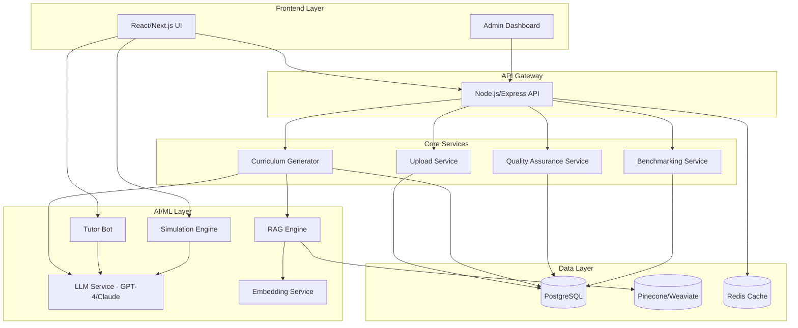

# Design Document

## Overview

The Curriculum Generator App is a full-stack web application that leverages AI and RAG technology to automate curriculum creation. The system follows a microservices-inspired architecture with clear separation between the frontend interface, backend API services, AI processing pipeline, and data storage layers.

The application processes SME-submitted Excel templates through a multi-stage pipeline: validation → knowledge retrieval → content generation → quality assurance → benchmarking → document export. Each stage is designed as an independent module with well-defined interfaces to enable parallel processing and future extensibility.

## Architecture

### High-Level Architecture



### Technology Stack Decisions

**Frontend:**
- Next.js 14 with App Router for SSR and optimal performance
- TypeScript for type safety
- Tailwind CSS for responsive styling
- React Query for server state management
- Zustand for client state management

**Backend:**
- Node.js with Express for API services (familiar ecosystem, excellent async handling)
- Python FastAPI for AI/ML services (better ML library support)
- TypeScript for type-safe API development

**Database:**
- PostgreSQL 15 with pgvector extension for relational data and basic vector operations
- Pinecone for production-grade vector search (managed, scalable)
- Redis for caching and session management

**AI/ML:**
- LangChain for RAG orchestration
- OpenAI GPT-4 for content generation
- OpenAI text-embedding-3-large for embeddings
- Sentence-Transformers as fallback embedding option

**Infrastructure:**
- Docker for containerization
- AWS ECS for container orchestration
- AWS S3 for document storage
- AWS CloudFront for CDN
- GitHub Actions for CI/CD

## Components and Interfaces

### 1. Upload Service

**Responsibility:** Handle SME Excel template uploads, validation, and parsing

**Interface:**
```typescript
interface UploadService {
  validateExcelStructure(file: File): ValidationResult;
  parseExcelData(file: File): ParsedProgramData;
  storeProgramData(data: ParsedProgramData): Promise<ProgramId>;
}

interface ValidationResult {
  isValid: boolean;
  errors: ValidationError[];
  warnings: ValidationWarning[];
}

interface ParsedProgramData {
  programOverview: ProgramOverview;
  competencyFramework: CompetencyDomain[];
  learningOutcomes: LearningOutcome[];
  courseFramework: Module[];
  topicSources: TopicSource[];
  readingLists: ReadingItem[];
  assessments: Assessment[];
  glossary: GlossaryTerm[];
  caseStudies: CaseStudy[];
  deliverySpecs: DeliverySpecification;
}
```

**Implementation Details:**
- Use `exceljs` library for parsing .xlsx files
- Validate against JSON schema for each sheet
- Implement streaming parser for large files
- Store raw Excel file in S3 with metadata in PostgreSQL

### 2. Knowledge Base Service

**Responsibility:** Ingest, process, and store educational content for RAG

**Interface:**
```typescript
interface KnowledgeBaseService {
  ingestDocument(source: DocumentSource): Promise<IngestionResult>;
  searchSemantic(query: string, filters: SearchFilters): Promise<SearchResult[]>;
  validateSource(source: DocumentSource): SourceValidation;
}

interface DocumentSource {
  type: 'pdf' | 'docx' | 'url';
  content: string | Buffer;
  metadata: SourceMetadata;
}

interface SourceMetadata {
  title: string;
  author?: string;
  publicationDate: Date;
  domain: string;
  credibilityScore: number; // 0-100
  tags: string[];
}

interface SearchResult {
  content: string;
  source: SourceMetadata;
  similarityScore: number;
  relevanceRank: number;
}
```

**Implementation Details:**
- Document chunking strategy: 512 tokens with 50 token overlap
- Use LangChain's RecursiveCharacterTextSplitter
- Generate embeddings in batches of 100
- Store in Pinecone with namespace per domain
- Implement caching layer for frequent queries

### 3. RAG Engine

**Responsibility:** Orchestrate retrieval and generation for curriculum content

**Interface:**
```typescript
interface RAGEngine {
  retrieveContext(query: string, options: RetrievalOptions): Promise<Context[]>;
  generateContent(prompt: string, context: Context[]): Promise<GeneratedContent>;
  attributeSources(content: GeneratedContent): ContentWithCitations;
}

interface RetrievalOptions {
  domains: string[];
  maxSources: number;
  minSimilarity: number;
  recencyWeight: number;
}

interface Context {
  content: string;
  source: SourceMetadata;
  relevanceScore: number;
}

interface GeneratedContent {
  text: string;
  usedSources: string[]; // source IDs
  confidence: number;
}
```

**Implementation Details:**
- Multi-query retrieval: generate 3 variations of each query
- Hybrid search: combine semantic (0.7 weight) + keyword (0.3 weight)
- Re-ranking using cross-encoder model
- Source attribution via prompt engineering
- Implement fact-checking by comparing generated content against retrieved sources

### 4. Curriculum Generator

**Responsibility:** Orchestrate the complete curriculum generation pipeline

**Interface:**
```typescript
interface CurriculumGenerator {
  generateCurriculum(programId: string): Promise<GenerationJob>;
  getGenerationStatus(jobId: string): Promise<JobStatus>;
  getCurriculum(programId: string): Promise<Curriculum>;
}

interface GenerationJob {
  jobId: string;
  status: 'queued' | 'processing' | 'completed' | 'failed';
  progress: number; // 0-100
  estimatedCompletion: Date;
}

interface Curriculum {
  programSpec: ProgramSpecification;
  unitSpecs: UnitSpecification[];
  assessmentPackage: AssessmentPackage;
  skillBook: SkillMapping[];
}
```

**Implementation Details:**
- Implement as async job queue using Bull
- Pipeline stages: validate → retrieve → generate → qa → benchmark
- Parallel processing where possible (unit specs can be generated concurrently)
- Store intermediate results for resume capability
- Emit progress events via WebSocket

### 5. Skill Book Generator

**Responsibility:** Map competencies to practical activities and KPIs

**Interface:**
```typescript
interface SkillBookGenerator {
  generateSkillMappings(competencies: CompetencyDomain[]): Promise<SkillMapping[]>;
  linkToLearningOutcomes(skills: SkillMapping[], outcomes: LearningOutcome[]): SkillMapping[];
}

interface SkillMapping {
  skillId: string;
  skillName: string;
  domain: string;
  activities: PracticalActivity[];
  kpis: MeasurableKPI[];
  linkedOutcomes: string[]; // outcome IDs
  assessmentCriteria: string[];
}

interface PracticalActivity {
  name: string;
  description: string;
  unitLink: string;
  durationHours: number;
  assessmentType: string;
  resources: string[];
}
```

**Implementation Details:**
- Use LLM with structured output (JSON mode)
- Prompt includes examples of good skill mappings
- Validate KPIs are measurable (contain numbers or completion criteria)
- Cross-reference with industry skill frameworks (e.g., O*NET)

### 6. Quality Assurance Service

**Responsibility:** Validate curriculum against AGCQ standards

**Interface:**
```typescript
interface QualityAssuranceService {
  validateCurriculum(curriculum: Curriculum): Promise<QAReport>;
  checkSources(sources: SourceMetadata[]): SourceValidation[];
  validateLearningOutcomes(outcomes: LearningOutcome[]): OutcomeValidation[];
  validateHours(modules: Module[]): HoursValidation;
}

interface QAReport {
  overallScore: number; // 0-100
  complianceIssues: ComplianceIssue[];
  recommendations: string[];
  passedChecks: string[];
}

interface ComplianceIssue {
  severity: 'error' | 'warning';
  category: string;
  description: string;
  location: string;
  suggestion: string;
}
```

**Implementation Details:**
- Rule-based validation for quantitative checks
- LLM-based validation for qualitative checks (e.g., learning outcome quality)
- Bloom's Taxonomy verb list for outcome validation
- APA 7 citation format validation using regex patterns
- Generate detailed reports with line-by-line feedback

### 7. Benchmarking Service

**Responsibility:** Compare curriculum against competitor institutions

**Interface:**
```typescript
interface BenchmarkingService {
  compareCurriculum(programId: string): Promise<BenchmarkReport>;
  loadCompetitorData(institution: string): Promise<CompetitorProgram>;
  identifyGaps(generated: Curriculum, benchmark: CompetitorProgram): Gap[];
}

interface BenchmarkReport {
  comparisons: InstitutionComparison[];
  overallSimilarity: number;
  gaps: Gap[];
  strengths: Strength[];
  recommendations: string[];
}

interface InstitutionComparison {
  institutionName: string;
  similarityScore: number;
  topicCoverage: number;
  assessmentAlignment: number;
}
```

**Implementation Details:**
- Store competitor curricula as structured data
- Use semantic similarity for topic comparison
- Identify gaps using set difference on topic embeddings
- Generate recommendations using LLM with comparison context

### 8. Tutor Bot Service

**Responsibility:** Provide AI-powered student support

**Interface:**
```typescript
interface TutorBotService {
  chat(studentId: string, message: string, courseId: string): Promise<TutorResponse>;
  getConversationHistory(studentId: string): Promise<Message[]>;
  trackProgress(studentId: string): Promise<ProgressReport>;
}

interface TutorResponse {
  message: string;
  suggestedResources: Resource[];
  followUpQuestions: string[];
  responseTime: number;
}
```

**Implementation Details:**
- Maintain conversation context (last 10 messages)
- RAG over course content for accurate responses
- Implement Socratic prompting strategy
- Track student comprehension signals (question complexity, topic repetition)
- Use streaming responses for better UX

### 9. Simulation Engine

**Responsibility:** Create and manage interactive learning scenarios

**Interface:**
```typescript
interface SimulationEngine {
  createScenario(topic: string, difficulty: number): Promise<Scenario>;
  processAction(scenarioId: string, action: StudentAction): Promise<ScenarioState>;
  evaluatePerformance(scenarioId: string): Promise<PerformanceReport>;
}

interface Scenario {
  scenarioId: string;
  title: string;
  context: string;
  initialState: ScenarioState;
  learningObjectives: string[];
}

interface ScenarioState {
  currentSituation: string;
  availableActions: Action[];
  feedback: string;
  score: number;
}
```

**Implementation Details:**
- Generate scenarios using LLM with domain-specific prompts
- Implement decision tree structure for branching paths
- Store scenario templates for common topics
- Evaluate using rubric-based scoring
- Allow scenario replay with different choices

### 10. Document Export Service

**Responsibility:** Generate professional documents in multiple formats

**Interface:**
```typescript
interface DocumentExportService {
  exportProgramSpec(programId: string, format: 'docx' | 'pdf'): Promise<Buffer>;
  exportUnitSpec(unitId: string, format: 'docx' | 'pdf'): Promise<Buffer>;
  exportAssessmentPackage(programId: string, format: 'docx' | 'pdf'): Promise<Buffer>;
  exportSCORM(programId: string): Promise<Buffer>;
}
```

**Implementation Details:**
- Use `docx` library for DOCX generation
- Use Puppeteer for PDF generation (render HTML then convert)
- Implement professional templates with AGCQ branding
- Include table of contents, page numbers, headers/footers
- Generate SCORM packages using scorm-again library

## Data Models

### PostgreSQL Schema

```sql
-- Programs table
CREATE TABLE programs (
    id UUID PRIMARY KEY DEFAULT gen_random_uuid(),
    program_name VARCHAR(255) NOT NULL,
    qualification_level VARCHAR(50) NOT NULL,
    qualification_type VARCHAR(50) NOT NULL,
    total_credits INTEGER NOT NULL DEFAULT 120,
    industry_sector VARCHAR(100),
    created_at TIMESTAMP DEFAULT NOW(),
    updated_at TIMESTAMP DEFAULT NOW(),
    status VARCHAR(50) DEFAULT 'draft',
    created_by UUID REFERENCES users(id)
);

-- Modules table
CREATE TABLE modules (
    id UUID PRIMARY KEY DEFAULT gen_random_uuid(),
    program_id UUID REFERENCES programs(id) ON DELETE CASCADE,
    module_code VARCHAR(20) NOT NULL,
    module_title VARCHAR(255) NOT NULL,
    hours INTEGER NOT NULL,
    module_aim TEXT,
    core_elective VARCHAR(20),
    sequence_order INTEGER,
    created_at TIMESTAMP DEFAULT NOW()
);

-- Learning outcomes table
CREATE TABLE learning_outcomes (
    id UUID PRIMARY KEY DEFAULT gen_random_uuid(),
    module_id UUID REFERENCES modules(id) ON DELETE CASCADE,
    outcome_text TEXT NOT NULL,
    assessment_criteria JSONB,
    knowledge_skill_competency VARCHAR(20),
    bloom_level VARCHAR(50),
    created_at TIMESTAMP DEFAULT NOW()
);

-- Knowledge base table
CREATE TABLE knowledge_base (
    id UUID PRIMARY KEY DEFAULT gen_random_uuid(),
    content TEXT NOT NULL,
    source_url VARCHAR(500),
    source_type VARCHAR(50),
    publication_date DATE,
    domain VARCHAR(100),
    credibility_score INTEGER CHECK (credibility_score BETWEEN 0 AND 100),
    metadata JSONB,
    created_at TIMESTAMP DEFAULT NOW(),
    embedding_id VARCHAR(255) -- Reference to Pinecone
);

-- Assessments table
CREATE TABLE assessments (
    id UUID PRIMARY KEY DEFAULT gen_random_uuid(),
    module_id UUID REFERENCES modules(id) ON DELETE CASCADE,
    question_type VARCHAR(50) NOT NULL,
    question_text TEXT NOT NULL,
    options JSONB,
    correct_answer TEXT,
    explanation TEXT,
    difficulty VARCHAR(20),
    learning_outcome_id UUID REFERENCES learning_outcomes(id),
    created_at TIMESTAMP DEFAULT NOW()
);

-- Skill mappings table
CREATE TABLE skill_mappings (
    id UUID PRIMARY KEY DEFAULT gen_random_uuid(),
    program_id UUID REFERENCES programs(id) ON DELETE CASCADE,
    skill_name VARCHAR(255) NOT NULL,
    domain VARCHAR(100),
    activities JSONB NOT NULL,
    kpis JSONB NOT NULL,
    linked_outcomes UUID[] DEFAULT '{}',
    assessment_criteria JSONB,
    created_at TIMESTAMP DEFAULT NOW()
);

-- Generation jobs table
CREATE TABLE generation_jobs (
    id UUID PRIMARY KEY DEFAULT gen_random_uuid(),
    program_id UUID REFERENCES programs(id) ON DELETE CASCADE,
    status VARCHAR(50) DEFAULT 'queued',
    progress INTEGER DEFAULT 0,
    started_at TIMESTAMP,
    completed_at TIMESTAMP,
    error_message TEXT,
    created_at TIMESTAMP DEFAULT NOW()
);

-- Competitor programs table (for benchmarking)
CREATE TABLE competitor_programs (
    id UUID PRIMARY KEY DEFAULT gen_random_uuid(),
    institution_name VARCHAR(255) NOT NULL,
    program_name VARCHAR(255) NOT NULL,
    level VARCHAR(50),
    topics JSONB,
    structure JSONB,
    created_at TIMESTAMP DEFAULT NOW()
);

-- Users table
CREATE TABLE users (
    id UUID PRIMARY KEY DEFAULT gen_random_uuid(),
    email VARCHAR(255) UNIQUE NOT NULL,
    role VARCHAR(50) NOT NULL,
    auth_provider_id VARCHAR(255),
    created_at TIMESTAMP DEFAULT NOW(),
    last_login TIMESTAMP
);

-- Audit log table
CREATE TABLE audit_logs (
    id UUID PRIMARY KEY DEFAULT gen_random_uuid(),
    user_id UUID REFERENCES users(id),
    action VARCHAR(100) NOT NULL,
    resource_type VARCHAR(50),
    resource_id UUID,
    details JSONB,
    created_at TIMESTAMP DEFAULT NOW()
);

-- Indexes for performance
CREATE INDEX idx_programs_status ON programs(status);
CREATE INDEX idx_modules_program ON modules(program_id);
CREATE INDEX idx_learning_outcomes_module ON learning_outcomes(module_id);
CREATE INDEX idx_assessments_module ON assessments(module_id);
CREATE INDEX idx_knowledge_base_domain ON knowledge_base(domain);
CREATE INDEX idx_generation_jobs_status ON generation_jobs(status);
CREATE INDEX idx_audit_logs_user ON audit_logs(user_id);
CREATE INDEX idx_audit_logs_created ON audit_logs(created_at);
```

### Pinecone Vector Database Schema

```typescript
interface PineconeMetadata {
  content: string;
  source_url: string;
  source_type: string;
  publication_date: string;
  domain: string;
  credibility_score: number;
  tags: string[];
  chunk_index: number;
  total_chunks: number;
}

// Namespace structure: {domain}/{source_type}
// Example: "business-intelligence/peer-reviewed"
```

## Error Handling

### Error Categories

1. **Validation Errors** (400): Invalid input data
2. **Authentication Errors** (401): Invalid or missing credentials
3. **Authorization Errors** (403): Insufficient permissions
4. **Not Found Errors** (404): Resource doesn't exist
5. **Processing Errors** (422): Valid input but processing failed
6. **Rate Limit Errors** (429): Too many requests
7. **Server Errors** (500): Internal system failures
8. **External Service Errors** (502/503): LLM API or database failures

### Error Response Format

```typescript
interface ErrorResponse {
  error: {
    code: string;
    message: string;
    details?: any;
    timestamp: string;
    requestId: string;
  };
}
```

### Error Handling Strategy

**Frontend:**
- Display user-friendly error messages
- Implement retry logic with exponential backoff for transient errors
- Show loading states during retries
- Log errors to monitoring service (Sentry)

**Backend:**
- Wrap all async operations in try-catch
- Use middleware for centralized error handling
- Log errors with context (user, request, stack trace)
- Implement circuit breaker for external services
- Return appropriate HTTP status codes

**AI Services:**
- Implement fallback strategies (e.g., use cached results)
- Set timeouts for LLM calls (30 seconds)
- Retry failed LLM calls up to 3 times
- Gracefully degrade when AI services unavailable

## Testing Strategy

### Unit Testing

**Coverage Target:** 80% for business logic

**Tools:**
- Jest for JavaScript/TypeScript
- pytest for Python services
- React Testing Library for components

**Focus Areas:**
- Validation logic
- Data transformations
- Business rule enforcement
- Utility functions

### Integration Testing

**Tools:**
- Supertest for API testing
- Testcontainers for database testing

**Focus Areas:**
- API endpoint functionality
- Database operations
- Service-to-service communication
- Authentication flows

### End-to-End Testing

**Tools:**
- Playwright for browser automation

**Critical Flows:**
1. SME uploads Excel → curriculum generated → documents exported
2. Admin reviews quality report → makes adjustments → regenerates
3. Student interacts with tutor bot → receives relevant responses
4. Student completes simulation → receives performance feedback

### Performance Testing

**Tools:**
- k6 for load testing
- Artillery for stress testing

**Targets:**
- API response time: < 2 seconds (p95)
- Curriculum generation: < 5 minutes
- Concurrent users: 100+
- Database query time: < 100ms (p95)

### AI/ML Testing

**Approaches:**
- Golden dataset testing (compare outputs against expected results)
- Human evaluation of generated content quality
- A/B testing different prompts
- Monitor hallucination rates
- Track source attribution accuracy

### Security Testing

**Tools:**
- OWASP ZAP for vulnerability scanning
- npm audit / pip-audit for dependency vulnerabilities

**Focus Areas:**
- SQL injection prevention
- XSS prevention
- CSRF protection
- Authentication bypass attempts
- Authorization boundary testing

## Performance Optimization

### Caching Strategy

**Redis Cache Layers:**
1. API response cache (5 minutes TTL)
2. Knowledge base query cache (1 hour TTL)
3. Generated content cache (24 hours TTL)
4. Session data (30 minutes TTL)

### Database Optimization

- Use connection pooling (max 20 connections)
- Implement read replicas for analytics queries
- Use materialized views for complex aggregations
- Partition large tables by date
- Regular VACUUM and ANALYZE operations

### AI Service Optimization

- Batch embedding generation (100 items per batch)
- Cache embeddings for reused content
- Use streaming for LLM responses
- Implement request queuing to avoid rate limits
- Use cheaper models for simple tasks (GPT-3.5 for validation)

### Frontend Optimization

- Code splitting by route
- Lazy load heavy components
- Implement virtual scrolling for long lists
- Optimize images with Next.js Image component
- Use React.memo for expensive components
- Implement optimistic UI updates

## Security Considerations

### Authentication & Authorization

- Use Auth0 with JWT tokens
- Implement refresh token rotation
- Store tokens in httpOnly cookies
- Role-based access control (RBAC)
- Multi-factor authentication for admins

### Data Protection

- Encrypt sensitive data at rest (AES-256)
- Use TLS 1.3 for data in transit
- Implement field-level encryption for PII
- Regular security audits
- GDPR compliance for user data

### API Security

- Rate limiting (100 requests/minute per user)
- Input validation and sanitization
- CORS configuration
- API key rotation
- Request signing for sensitive operations

### Infrastructure Security

- Network isolation with VPCs
- Security groups for access control
- Regular security patches
- Secrets management with AWS Secrets Manager
- DDoS protection with CloudFlare

## Deployment Architecture

### Container Structure

```yaml
services:
  frontend:
    image: curriculum-app-frontend:latest
    ports: ["3000:3000"]
    environment:
      - NEXT_PUBLIC_API_URL
      - NEXT_PUBLIC_AUTH0_DOMAIN
    
  api:
    image: curriculum-app-api:latest
    ports: ["4000:4000"]
    environment:
      - DATABASE_URL
      - REDIS_URL
      - OPENAI_API_KEY
    
  ai-service:
    image: curriculum-app-ai:latest
    ports: ["5000:5000"]
    environment:
      - PINECONE_API_KEY
      - OPENAI_API_KEY
    
  worker:
    image: curriculum-app-worker:latest
    environment:
      - REDIS_URL
      - DATABASE_URL
```

### CI/CD Pipeline

1. **Build Stage:** Run tests, lint, build Docker images
2. **Security Scan:** Scan images for vulnerabilities
3. **Deploy to Staging:** Automatic deployment on main branch
4. **Integration Tests:** Run E2E tests in staging
5. **Deploy to Production:** Manual approval required
6. **Health Checks:** Verify deployment success
7. **Rollback:** Automatic rollback on health check failure

### Monitoring & Observability

**Tools:**
- CloudWatch for logs and metrics
- Sentry for error tracking
- DataDog for APM
- Prometheus + Grafana for custom metrics

**Key Metrics:**
- API response times
- Error rates
- Curriculum generation success rate
- LLM API costs
- Database query performance
- Cache hit rates
- User engagement metrics

## Scalability Considerations

### Horizontal Scaling

- Stateless API servers (scale with load balancer)
- Worker processes for async jobs (scale based on queue depth)
- Database read replicas (scale read operations)

### Vertical Scaling

- Increase AI service resources for faster generation
- Larger database instances for complex queries

### Cost Optimization

- Use spot instances for non-critical workers
- Implement request batching for LLM calls
- Cache aggressively to reduce API calls
- Use cheaper embedding models where appropriate
- Archive old programs to cold storage

This design provides a robust, scalable foundation for the Curriculum Generator App while maintaining flexibility for future enhancements.
