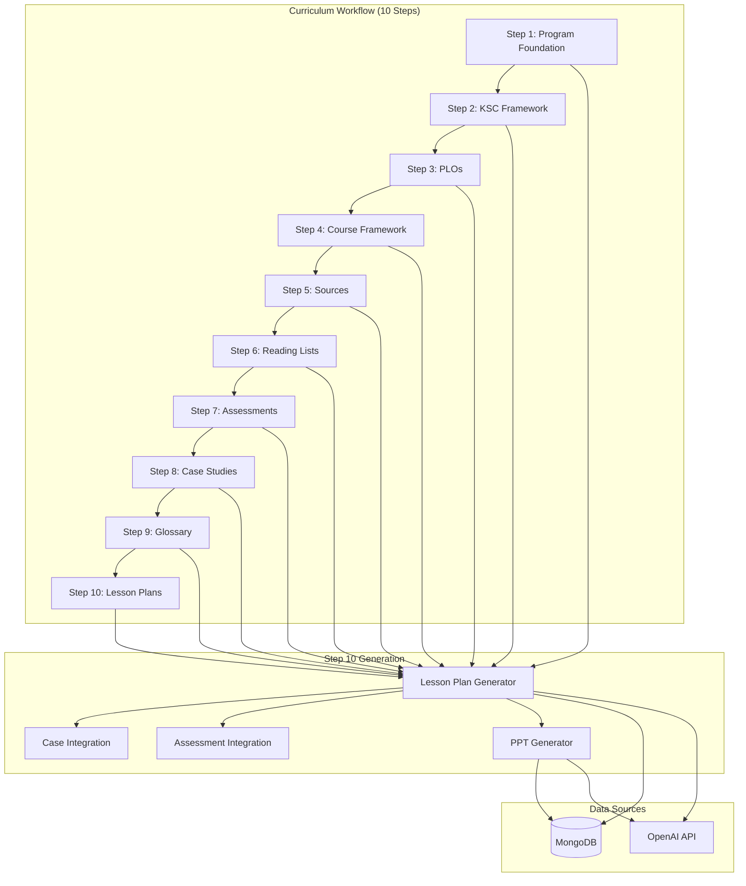
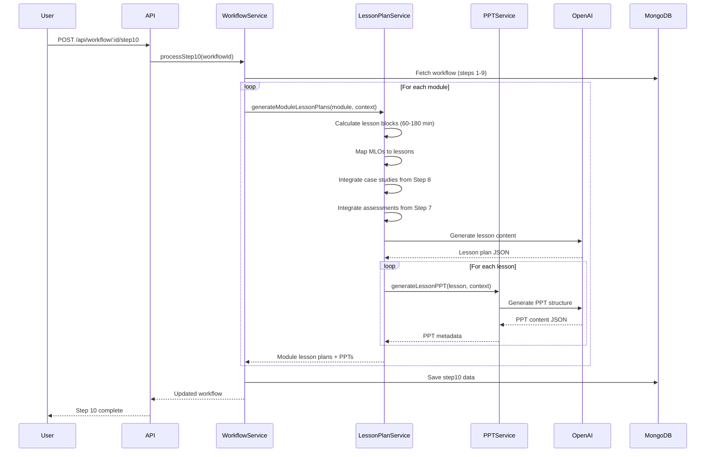

# Design Document: Lesson Plan Generation (Step 10) & PPT Generation Improvements

## Overview

This design document outlines the architecture and implementation approach for integrating Step 10 (Lesson Plan Generation) into the existing 9-step curriculum generation workflow and improving the PPT Generation service to align with the Step 11 specification. The system will be extended to support a 10-step workflow where lesson plans are generated using context from all previous steps, and PPT decks are generated based on the lesson plans with delivery mode adaptations.

### Key Changes

1. **Workflow Extension**: Extend CurriculumWorkflow model from 9 to 10 steps
2. **Lesson Plan Generation**: New service to generate detailed lesson plans per module
3. **PPT Generation Enhancement**: Improve PPT generation to follow Step 11 specification
4. **Document Export Update**: Include all 10 steps in final curriculum document

## Architecture

### High-Level Architecture



### Lesson Plan Generation Flow



## Components and Interfaces

### 1. LessonPlanService

New service responsible for generating lesson plans for each module.

```typescript
interface LessonPlanService {
  // Main entry point for Step 10 generation
  generateLessonPlans(workflowId: string): Promise<Step10LessonPlans>;

  // Generate lesson plans for a single module
  generateModuleLessonPlans(
    module: ModuleData,
    context: WorkflowContext
  ): Promise<ModuleLessonPlan>;

  // Calculate lesson blocks based on contact hours
  calculateLessonBlocks(contactHours: number, mlos: MLO[]): LessonBlock[];

  // Integrate case studies into lessons
  integrateCaseStudies(
    lessons: LessonBlock[],
    caseStudies: CaseStudy[],
    moduleId: string
  ): LessonBlock[];

  // Integrate formative assessments into lessons
  integrateAssessments(
    lessons: LessonBlock[],
    assessments: FormativeAssessment[],
    moduleId: string
  ): LessonBlock[];

  // Validate generated lesson plans
  validateLessonPlans(lessonPlans: ModuleLessonPlan[], modules: ModuleData[]): ValidationResult;
}
```

### 2. Enhanced PPTGenerationService

Updated service for generating PPT decks based on lesson plans.

```typescript
interface PPTGenerationService {
  // Generate PPT for a single lesson
  generateLessonPPT(lesson: LessonPlan, context: PPTContext): Promise<PPTDeck>;

  // Generate all PPTs for a module
  generateModulePPTs(moduleLessonPlan: ModuleLessonPlan, context: PPTContext): Promise<PPTDeck[]>;

  // Adapt slides based on delivery mode
  adaptForDeliveryMode(slides: SlideContent[], deliveryMode: DeliveryMode): SlideContent[];

  // Validate PPT deck
  validatePPTDeck(
    deck: PPTDeck,
    lesson: LessonPlan,
    context: ValidationContext
  ): PPTValidationResult;

  // Export PPT in multiple formats
  exportPPT(deck: PPTDeck, format: 'pptx' | 'pdf' | 'images'): Promise<Buffer | Buffer[]>;
}
```

### 3. Updated WorkflowService

Extended to support Step 10 processing.

```typescript
interface WorkflowService {
  // Existing methods...

  // New Step 10 processing
  processStep10(workflowId: string): Promise<ICurriculumWorkflow>;

  // Generate Step 10 content
  generateStep10Content(workflow: ICurriculumWorkflow): Promise<Step10Data>;
}
```

### 4. Updated WordExportService

Extended to include Step 10 in document export.

```typescript
interface WordExportService {
  // Updated to include all 10 steps
  generateDocument(workflow: WorkflowData, progressCallback?: ProgressCallback): Promise<Buffer>;

  // New method for Step 10 section
  generateStep10Section(step10: Step10LessonPlans, contentChildren: any[]): void;
}
```

## Data Models

### Step 10 Data Structure

```typescript
interface Step10LessonPlans {
  // Module lesson plans
  moduleLessonPlans: ModuleLessonPlan[];

  // Validation results
  validation: {
    allModulesHaveLessonPlans: boolean;
    allLessonDurationsValid: boolean;
    totalHoursMatch: boolean;
    allMLOsCovered: boolean;
    caseStudiesIntegrated: boolean;
    assessmentsIntegrated: boolean;
  };

  // Summary statistics
  summary: {
    totalLessons: number;
    totalContactHours: number;
    averageLessonDuration: number;
    caseStudiesIncluded: number;
    formativeChecksIncluded: number;
  };

  // Metadata
  generatedAt: Date;
  validatedAt?: Date;
  approvedAt?: Date;
  approvedBy?: string;
}

interface ModuleLessonPlan {
  moduleId: string;
  moduleCode: string;
  moduleTitle: string;
  totalContactHours: number;
  totalLessons: number;

  lessons: LessonPlan[];

  // PPT references
  pptDecks: PPTDeckReference[];
}

interface LessonPlan {
  // Metadata
  lessonId: string;
  lessonNumber: number;
  lessonTitle: string;
  duration: number; // minutes (60-180)

  // Learning alignment
  linkedMLOs: string[];
  linkedPLOs: string[];
  bloomLevel: string;

  // Objectives
  objectives: string[];

  // Activity sequence
  activities: LessonActivity[];

  // Materials
  materials: {
    pptDeckRef: string;
    caseFiles: string[];
    readingReferences: ReadingReference[];
  };

  // Instructor guidance
  instructorNotes: {
    pedagogicalGuidance: string;
    pacingSuggestions: string;
    adaptationOptions: string[];
    commonMisconceptions: string[];
    discussionPrompts: string[];
  };

  // Independent study
  independentStudy: {
    coreReadings: ReadingAssignment[];
    supplementaryReadings: ReadingAssignment[];
    estimatedEffort: number; // minutes
  };

  // Integrated case study (if applicable)
  caseStudyActivity?: CaseStudyActivity;

  // Formative checks
  formativeChecks: FormativeCheck[];
}

interface LessonActivity {
  activityId: string;
  sequenceOrder: number;
  type:
    | 'mini_lecture'
    | 'discussion'
    | 'demonstration'
    | 'practice'
    | 'role_play'
    | 'case_analysis'
    | 'group_work'
    | 'assessment'
    | 'break';
  title: string;
  description: string;
  duration: number; // minutes
  teachingMethod: string;
  resources: string[];
  instructorActions: string[];
  studentActions: string[];
}

interface CaseStudyActivity {
  caseStudyId: string;
  caseTitle: string;
  activityType: 'practice' | 'discussion' | 'assessment_ready';
  duration: number;
  learningPurpose: string;
  linkedMLOs: string[];
  linkedPLOs: string[];

  instructorInstructions: string;
  studentOutputExpectations: string[];

  assessmentHooks: {
    keyFacts: string[];
    misconceptions: string[];
    decisionPoints: string[];
  };

  // Role-play components (if applicable)
  rolePlay?: {
    characterBriefs: CharacterBrief[];
    decisionPrompts: string[];
    debriefQuestions: string[];
  };

  isFirstAppearance: boolean;
  previousAppearanceRef?: string;
}

interface FormativeCheck {
  checkId: string;
  type: 'mcq' | 'quick_poll' | 'discussion_question' | 'reflection';
  question: string;
  options?: string[];
  correctAnswer?: string;
  explanation?: string;
  linkedMLO: string;
  duration: number; // minutes
}
```

### PPT Data Structure

```typescript
interface PPTDeck {
  deckId: string;
  lessonId: string;
  moduleCode: string;
  lessonNumber: number;
  lessonTitle: string;

  // Slide content
  slides: PPTSlide[];

  // Metadata
  slideCount: number;
  deliveryMode: DeliveryMode;
  generatedAt: Date;

  // Validation
  validation: {
    slideCountValid: boolean;
    mlosCovered: boolean;
    citationsValid: boolean;
    glossaryTermsDefined: boolean;
  };

  // Export paths
  exports: {
    pptxPath?: string;
    pdfPath?: string;
    imagesPath?: string;
  };
}

interface PPTSlide {
  slideNumber: number;
  slideType:
    | 'title'
    | 'objectives'
    | 'concepts'
    | 'content'
    | 'case_study'
    | 'formative_check'
    | 'summary'
    | 'independent_study'
    | 'references';
  title: string;
  content: SlideContent;
  speakerNotes: string;
  visualSuggestion?: string;
}

interface SlideContent {
  // Varies by slide type
  bullets?: string[];
  paragraphs?: string[];
  table?: TableData;
  leftColumn?: string[];
  rightColumn?: string[];
  mcq?: MCQContent;
  citations?: string[];
}
```

### Updated CurriculumWorkflow Model

```typescript
interface ICurriculumWorkflow {
  // Existing fields...

  // Updated constraints
  currentStep: number; // 1-10 (was 1-9)
  status: string; // Now includes 'step10_pending', 'step10_complete'

  // Existing steps 1-9...
  step1?: Step1ProgramFoundation;
  step2?: Step2CompetencyKSA;
  step3?: Step3PLOs;
  step4?: Step4CourseFramework;
  step5?: Step5Sources;
  step6?: Step6ReadingLists;
  step7?: Step7Assessments;
  step8?: Step8CaseStudies;
  step9?: Step9Glossary;

  // New Step 10
  step10?: Step10LessonPlans;

  // Updated step progress (10 steps)
  stepProgress: StepProgress[]; // Now includes step 10
}
```

## Correctness Properties

_A property is a characteristic or behavior that should hold true across all valid executions of a system-essentially, a formal statement about what the system should do. Properties serve as the bridge between human-readable specifications and machine-verifiable correctness guarantees._

### Property 1: Lesson Duration Bounds

_For any_ generated lesson plan, the lesson duration SHALL be between 60 and 180 minutes inclusive.
**Validates: Requirements 1.3**

### Property 2: Contact Hours Integrity

_For any_ module, the sum of all lesson durations SHALL equal the module's total contact hours.
**Validates: Requirements 1.4**

### Property 3: MLO Alignment Coverage

_For any_ generated lesson, the lesson SHALL be aligned with 1-2 Module Learning Outcomes (MLOs).
**Validates: Requirements 1.5**

### Property 4: Bloom's Taxonomy Progression

_For any_ module's lesson sequence, earlier lessons SHALL have equal or lower Bloom's taxonomy levels compared to later lessons.
**Validates: Requirements 1.6**

### Property 5: Lesson Plan Completeness

_For any_ generated lesson plan, the plan SHALL include all required components: objectives, activities with timings, materials, instructor notes, and independent study assignments.
**Validates: Requirements 2.1, 2.2, 2.4, 2.5, 2.6, 5.1, 5.2, 5.3, 5.4, 5.5, 5.6**

### Property 6: Case Study Placement Correctness

_For any_ case study with MLO mappings, the case study SHALL appear in a lesson whose primary MLO alignment matches the case's MLO support.
**Validates: Requirements 3.1**

### Property 7: Role-Play Component Completeness

_For any_ case study marked as role-play suitable, the embedded activity SHALL include character briefs, decision prompts, and debrief questions.
**Validates: Requirements 3.3**

### Property 8: Lesson-PPT Correspondence

_For any_ generated lesson plan, there SHALL exist exactly one corresponding PPT deck.
**Validates: Requirements 6.1, 9.1**

### Property 9: PPT Slide Count Bounds

_For any_ generated PPT deck, the slide count SHALL be between 15 and 35 slides inclusive.
**Validates: Requirements 9.5**

### Property 10: PPT MLO Coverage

_For any_ generated PPT deck, all MLOs linked to the corresponding lesson SHALL appear in the slide content.
**Validates: Requirements 9.2**

### Property 11: Citation Validity

_For any_ citation in a PPT deck, the citation SHALL reference a verified source from Steps 5-6.
**Validates: Requirements 9.4**

### Property 12: Document Export Completeness

_For any_ exported curriculum document, the document SHALL include sections for all 10 steps in sequential order.
**Validates: Requirements 11.1, 11.2**

## Error Handling

### Generation Errors

1. **Insufficient Context**: If required data from previous steps is missing, throw descriptive error indicating which step data is needed.

2. **OpenAI API Failures**: Implement retry logic with exponential backoff. After 3 failures, use fallback template-based generation.

3. **Validation Failures**: Log validation issues but continue generation. Include validation report in output for user review.

4. **PPT Generation Failures**: If PPT generation fails for a lesson, log error and continue with other lessons. Mark failed PPTs in output.

### Validation Errors

1. **Duration Mismatch**: If lesson durations don't sum to contact hours, adjust final lesson duration and log warning.

2. **MLO Coverage Gap**: If some MLOs aren't covered by any lesson, generate additional lesson or extend existing lesson.

3. **Slide Count Violation**: If slide count exceeds bounds, consolidate or split slides as appropriate.

## Testing Strategy

### Dual Testing Approach

This implementation requires both unit tests and property-based tests:

**Unit Tests**: Verify specific examples, edge cases, and error conditions
**Property-Based Tests**: Verify universal properties that should hold across all inputs

### Property-Based Testing Framework

Use **fast-check** library for TypeScript property-based testing.

### Test Categories

1. **Lesson Plan Generation Tests**
   - Property tests for duration bounds (60-180 min)
   - Property tests for contact hours integrity
   - Property tests for MLO alignment (1-2 per lesson)
   - Property tests for Bloom's progression

2. **Case Study Integration Tests**
   - Property tests for correct placement based on MLO
   - Property tests for role-play component completeness
   - Property tests for multi-module handling

3. **PPT Generation Tests**
   - Property tests for lesson-PPT correspondence
   - Property tests for slide count bounds (15-35)
   - Property tests for MLO coverage in slides
   - Property tests for citation validity

4. **Document Export Tests**
   - Property tests for 10-step completeness
   - Property tests for section ordering

### Test Configuration

- Minimum 100 iterations per property test
- Each property test tagged with format: `**Feature: lesson-plan-ppt-integration, Property {number}: {property_text}**`
