# AI-Integrated Curriculum Generator - New Workflow

## Executive Summary

This document outlines the **revised workflow** for the Curriculum Generator platform, which integrates AI research tools for a more streamlined, intelligent curriculum development process. The new workflow emphasizes:

- **Prompt-based curriculum initiation** (replacing Excel uploads)
- **Preliminary research phase** with chat-based SME interaction
- **Resource cost evaluation and approval**
- **Two-stage generation**: Preliminary Package → Full Curriculum
- **Compliance with AGI (Academic Guidelines Institution) standards**

---

## Table of Contents

1. [Workflow Overview](#workflow-overview)
2. [Stage 1: SME Login and Prompt Selection](#stage-1-sme-login-and-prompt-selection)
3. [Stage 2: AI Research and SME Review](#stage-2-ai-research-and-sme-review)
4. [Stage 3: Resource Cost Evaluation](#stage-3-resource-cost-evaluation)
5. [Stage 4: Curriculum Generation](#stage-4-curriculum-generation)
6. [Stage 5: Final SME Review and Launch](#stage-5-final-sme-review-and-launch)
7. [Data Models](#data-models)
8. [Technical Architecture](#technical-architecture)
9. [Integration Requirements](#integration-requirements)

---

## Workflow Overview


### Key Workflow Stages

| Stage | Name                         | Duration  | Key Outputs                            |
| ----- | ---------------------------- | --------- | -------------------------------------- |
| **1** | SME Login & Prompt Selection | 5 min     | Selected prompt with preset parameters |
| **2** | AI Research & SME Review     | 30-60 min | Preliminary Curriculum Package         |
| **3** | Resource Cost Evaluation     | 15-30 min | Approved resource list                 |
| **4** | Curriculum Generation        | 20-40 min | Complete curriculum materials          |
| **5** | Final Review & Launch        | 30-60 min | Published course                       |

**Total Time: 2-4 hours** (compared to weeks in traditional curriculum development)

---

## Stage 1: SME Login and Prompt Selection

### Overview

The Subject Matter Expert (SME) logs into the platform and selects a course prompt from the internal library. Each prompt contains preset parameters and adheres to internal curriculum design rules.

### Process Flow


### Prompt Library Structure

Each prompt in the library contains:

| Field                       | Description                     | Example                                           |
| --------------------------- | ------------------------------- | ------------------------------------------------- |
| **Prompt Title**            | Course/program name             | "Business Intelligence Fundamentals"              |
| **Domain**                  | Subject area                    | "Data Analytics", "Business Management"           |
| **Level**                   | Qualification level             | "Bachelor's Degree", "Master's Certificate"       |
| **Total Hours**             | Credit hours                    | 120 hours                                         |
| **ECTS Credits**            | European Credit Transfer System | 15 ECTS                                           |
| **Module Count**            | Number of modules/units         | 6-8 modules                                       |
| **Learning Objectives**     | High-level goals                | "Develop BI competencies for decision-making"     |
| **Target Audience**         | Intended learners               | "Business professionals, data analysts"           |
| **Prerequisites**           | Entry requirements              | "Basic statistics, business fundamentals"         |
| **Curriculum Design Rules** | Internal guidelines             | AGI compliance standards, Bloom's taxonomy levels |

### User Interface

**Prompt Library Page:**

```
┌────────────────────────────────────────────────────────────────┐
│  Curriculum Generator - Prompt Library                         │
├────────────────────────────────────────────────────────────────┤
│                                                                 │
│  Filter by Domain: [All Domains ▼]    Search: [____________]  │
│                                                                 │
│  ┌──────────────────────────────────────────────────────────┐ │
│  │ 📘 Business Intelligence Fundamentals                    │ │
│  │    Level: Bachelor's Degree | 120 hours | 15 ECTS       │ │
│  │    Domain: Data Analytics                                │ │
│  │    [View Details]  [Select Prompt]                       │ │
│  └──────────────────────────────────────────────────────────┘ │
│                                                                 │
│  ┌──────────────────────────────────────────────────────────┐ │
│  │ 📗 Digital Marketing Strategy                            │ │
│  │    Level: Master's Certificate | 60 hours | 10 ECTS     │ │
│  │    Domain: Marketing                                     │ │
│  │    [View Details]  [Select Prompt]                       │ │
│  └──────────────────────────────────────────────────────────┘ │
│                                                                 │
└────────────────────────────────────────────────────────────────┘
```

### Data Model: Prompt Collection

```typescript
{
  _id: ObjectId,
  promptTitle: string,
  domain: string,
  level: string,              // 'bachelor' | 'master' | 'certificate' | 'diploma'
  totalHours: number,         // default: 120
  ectsCredits: number,        // default: 15
  moduleCount: number,        // default: 6-8
  learningObjectives: string[],
  targetAudience: string,
  prerequisites: string[],
  curriculumRules: {
    aginCompliance: boolean,
    bloomTaxonomyLevels: string[],
    assessmentTypes: string[],
    sourceRecencyYears: number,    // e.g., 5 years
    citationFormat: string          // 'APA 7'
  },
  status: enum,               // 'active' | 'inactive' | 'draft'
  createdBy: ObjectId,        // ref: User
  createdAt: Date,
  updatedAt: Date
}
```

### Key Actions

1. **SME logs in** → Authenticated via Auth0
2. **Browse prompt library** → Filtered by domain/level
3. **View prompt details** → Review preset parameters
4. **Select prompt** → Initialize curriculum project
5. **Proceed to research phase** → Trigger AI deep research

---

## Stage 2: AI Research and SME Review

### Overview

The AI generates a complete **Preliminary Curriculum Package** using deep research tools (integrated with Perplexity, ChatGPT, Gemini, or similar). The content is presented in a structured chat format where the SME provides real-time refinements, corrections, and feedback.

### Preliminary Curriculum Package Components

Based on AGI guidelines, the package includes:

| Component                                                    | Description                                                         |
| ------------------------------------------------------------ | ------------------------------------------------------------------- |
| **1. Program Overview**                                      | High-level program description, value proposition, market relevance |
| **2. Competency & Knowledge Framework**                      | Skills, knowledge areas, competencies mapped to industry standards  |
| **3. Learning Outcomes, Assessment Criteria & Competencies** | Specific, measurable outcomes aligned to Bloom's taxonomy           |
| **4. Course Framework**                                      | Module structure (120 hours, 6-8 modules) with credit distribution  |
| **5. Topic-Level Sources**                                   | Research sources in APA 7th format (≤ 5 years old)                  |
| **6. Indicative & Additional Reading List**                  | Curated reading materials with full citations                       |
| **7. Assessments**                                           | MCQs, case studies, rubrics, and marking schemes                    |
| **8. Glossary**                                              | Key terms and definitions                                           |
| **9. Case Studies**                                          | Real-world scenarios for practical application                      |
| **10. Delivery & Digital Tools**                             | Teaching methods, LMS integration, digital resources                |
| **11. References**                                           | Complete bibliography                                               |
| **12. Submission Metadata**                                  | Program metadata and compliance information                         |
| **13. Outcome Writing Guide**                                | Guidelines for creating measurable outcomes                         |

### AI Research Process

```mermaid
graph TB
    Init["Initialize Research<br/>with Prompt"] --> DeepResearch["AI Deep Research Tools<br/>(Perplexity, ChatGPT, Gemini)"]

    DeepResearch --> Component1["Generate Program<br/>Overview"]
    DeepResearch --> Component2["Generate Competency<br/>Framework"]
    DeepResearch --> Component3["Generate Learning<br/>Outcomes"]
    DeepResearch --> Component4["Generate Course<br/>Framework"]

    Component1 --> Compile["Compile Preliminary<br/>Curriculum Package"]
    Component2 --> Compile
    Component3 --> Compile
    Component4 --> Compile

    Compile --> Sources["Topic-Level<br/>Source Research"]
    Sources --> Filter["Filter Sources:<br/>- APA 7 format<br/>- ≤ 5 years old<br/>- High credibility"]
    Filter --> Assess["Generate<br/>Assessments"]
    Assess --> Glossary["Create Glossary<br/>& Case Studies"]
    Glossary --> Complete["Complete Preliminary<br/>Package"]

    Complete --> Present["Present to SME<br/>in Chat Format"]

    style Init fill:#e1f5ff
    style DeepResearch fill:#fff3e0
    style Complete fill:#c8e6c9
    style Present fill:#f3e5f5
```



### Chat-Based SME Interaction

The preliminary package is presented in a **conversational chat interface** where:

1. **AI presents each section** → SME reviews
2. **SME provides feedback** → Real-time corrections, additions, refinements
3. **AI updates content** → Incorporates SME feedback immediately
4. **Iterative refinement** → Continue until SME is satisfied
5. **Final approval** → SME submits package for next stage

**Example Chat Interface:**

```
┌────────────────────────────────────────────────────────────────┐
│  Curriculum Research Assistant                        [×]       │
├────────────────────────────────────────────────────────────────┤
│                                                                 │
│  🤖 AI: I've completed the Program Overview section. Here's   │
│         what I found:                                          │
│                                                                 │
│  📄 Program Overview                                           │
│  ━━━━━━━━━━━━━━━━━━━━━━━━━━━━━━━━━━━━━━━━━━━━━━━━━━━━━━━━━  │
│  Business Intelligence Fundamentals is designed to equip       │
│  learners with essential BI competencies for data-driven       │
│  decision-making in modern organizations...                    │
│                                                                 │
│  [View Full Section]                                           │
│                                                                 │
│  👤 SME: This looks good, but please emphasize the practical   │
│          applications in retail and e-commerce sectors.        │
│                                                                 │
│  🤖 AI: Understood. I've updated the overview to highlight:    │
│         - Retail analytics applications                        │
│         - E-commerce data analysis                             │
│         - Customer behavior modeling                           │
│                                                                 │
│  [✓ Approve Section]  [↻ Request Changes]                     │
│                                                                 │
│  ─────────────────────────────────────────────────────────     │
│                                                                 │
│  Type your feedback or approval...                             │
│  [_________________________________________________] [Send]    │
│                                                                 │
└────────────────────────────────────────────────────────────────┘
```

### Integration with AI Research Tools

The system integrates with multiple AI research tools for comprehensive content generation:

**1. Perplexity AI**

- Deep web research for current industry trends
- Source attribution with credible references
- Real-time data for market analysis

**2. OpenAI ChatGPT (GPT-4)**

- Content generation for program descriptions
- Learning outcome formulation
- Assessment question creation

**3. Google Gemini**

- Multi-modal content analysis
- Alternative perspective generation
- Source validation

### Source Quality Standards

All sources must meet AGI compliance:

| Criterion             | Requirement                                              |
| --------------------- | -------------------------------------------------------- |
| **Publication Date**  | ≤ 5 years old (unless classic/foundational)              |
| **Citation Format**   | APA 7th edition                                          |
| **Credibility Score** | ≥ 75/100                                                 |
| **Source Type**       | Academic journals, industry reports, authoritative texts |
| **Peer Review**       | Preferred (where applicable)                             |

### SME Submission

Once all sections are reviewed and approved:

1. **SME clicks "Submit for Approval"**
2. **System validates completeness** → All 13 components present
3. **Package saved to database** → `PreliminaryCurriculumPackage` collection
4. **Workflow advances** → Stage 3: Resource Cost Evaluation

---

## Stage 3: Resource Cost Evaluation

### Overview

If the preliminary curriculum package includes paid resources (textbooks, software licenses, proprietary databases), the AI calculates the total estimated cost and sends a notification to management for approval.

### Process Flow


### Resource Cost Calculation

```typescript
interface ResourceCost {
  resourceName: string;
  resourceType: 'textbook' | 'software' | 'database' | 'tool' | 'license';
  vendor: string;
  costPerStudent: number;
  estimatedStudents: number;
  totalCost: number;
  isRecurring: boolean;
  recurringPeriod?: 'monthly' | 'annually';
  justification: string;
  alternatives?: Array<{
    name: string;
    cost: number;
    quality: string;
    limitations: string;
  }>;
}
```

### Management Approval Interface

**Resource Approval Dashboard:**

```
┌────────────────────────────────────────────────────────────────┐
│  Resource Cost Approval - Business Intelligence Fundamentals  │
├────────────────────────────────────────────────────────────────┤
│                                                                 │
│  Submitted by: Dr. Jane Smith (SME)                            │
│  Date: October 29, 2025                                        │
│  Total Estimated Cost: $12,500 (for 100 students)             │
│                                                                 │
│  ┌──────────────────────────────────────────────────────────┐ │
│  │ Resource 1: Tableau Desktop License                      │ │
│  │ Vendor: Tableau (Salesforce)                             │ │
│  │ Cost: $70/student (annual)                               │ │
│  │ Total: $7,000 (100 students)                             │ │
│  │ Justification: Required for hands-on BI visualization    │ │
│  │                                                            │ │
│  │ Alternatives Suggested by AI:                             │ │
│  │ • Power BI (Free tier available, limitations apply)      │ │
│  │ • Google Data Studio (Free, cloud-based)                 │ │
│  └──────────────────────────────────────────────────────────┘ │
│                                                                 │
│  ┌──────────────────────────────────────────────────────────┐ │
│  │ Resource 2: "Business Intelligence: A Managerial..."     │ │
│  │ Vendor: Pearson                                           │ │
│  │ Cost: $55/student (e-book)                               │ │
│  │ Total: $5,500 (100 students)                             │ │
│  │ Justification: Core textbook for foundational concepts   │ │
│  │                                                            │ │
│  │ Alternatives Suggested by AI:                             │ │
│  │ • Open Educational Resources (OER) - Free                │ │
│  │ • Library e-book subscription (existing institutional)   │ │
│  └──────────────────────────────────────────────────────────┘ │
│                                                                 │
│  [✓ Approve All] [✗ Reject All] [Review Individually]         │
│                                                                 │
└────────────────────────────────────────────────────────────────┘
```

### Alternative Suggestion Logic

If resources are rejected, the AI:

1. **Searches for open-source alternatives**
2. **Evaluates quality and functionality**
3. **Generates comparison report**
4. **Suggests replacements**
5. **Updates instructional plan if needed**

**Example Substitution:**

| Original         | Alternative                        | Quality           | Cost Savings |
| ---------------- | ---------------------------------- | ----------------- | ------------ |
| Tableau Desktop  | Power BI Free + Google Data Studio | 85% functionality | $7,000       |
| Pearson Textbook | OER + Curated articles             | 90% coverage      | $5,500       |

### Package Re-Approval

If substitutions require changes to the instructional plan:

1. **AI updates affected sections** (e.g., "Delivery & Digital Tools")
2. **Revised package sent to SME via chat**
3. **SME reviews changes**
4. **SME approves or requests further changes**

---

## Stage 4: Curriculum Generation

### Overview

Once all content and resources are approved, the **curriculum generator creates the full course** using the preliminary curriculum package as the authoritative source.

### Full Curriculum Components


### Template Alignment

The generator uses **structured templates** aligned with internal formatting and pedagogical standards:

| Template Type            | Purpose                     | Key Features                                        |
| ------------------------ | --------------------------- | --------------------------------------------------- |
| **Module Plan Template** | Detailed module structure   | Learning outcomes, content, activities, assessments |
| **Case Study Template**  | Real-world scenario format  | Context, problem statement, questions, rubric       |
| **Simulation Template**  | Interactive exercise format | Objectives, instructions, datasets, evaluation      |
| **Assessment Template**  | Question bank format        | MCQs, short answer, essays with marking schemes     |
| **Slide Deck Template**  | Presentation format         | Branded design, consistent layout, visual hierarchy |

### Cross-Referencing & Traceability

Every generated material is **cross-referenced** with the Preliminary Curriculum Package to ensure:

- **Consistency:** Content aligns with approved program overview
- **Completeness:** All learning outcomes are addressed
- **Compliance:** AGI standards maintained throughout
- **Source Attribution:** All sources from the preliminary package are properly cited

### Source Citation Requirements

**All materials must cite sources** from the preliminary package:

```markdown
# Module 3: Data Visualization Techniques

## Learning Outcomes

Students will be able to:

1. Design effective data visualizations using BI tools (Bloom's: Create)
2. Evaluate visualization effectiveness for different audiences (Bloom's: Evaluate)

Source: Competency Framework, Preliminary Curriculum Package

## Indicative Content

- Principles of visual perception (Few, 2012)
- Dashboard design best practices (Tableau, 2023)
- Interactive visualization techniques (Murray, 2021)

All sources cited in APA 7 format per AGI standards.
```

### Generation Process Timeline

| Sub-Stage    | Duration   | Output                          |
| ------------ | ---------- | ------------------------------- |
| Module Plans | 10 min     | 6-8 detailed module plans       |
| Case Studies | 8 min      | 3-5 case studies                |
| Simulations  | 10 min     | 2-4 simulations                 |
| Assessments  | 7 min      | 50-100 MCQs + rubrics           |
| Slide Decks  | 10 min     | 6-8 PowerPoint/Canva decks      |
| **Total**    | **45 min** | **Complete curriculum package** |

### Quality Assurance During Generation

The system automatically validates:

1. **Outcome Coverage:** Every learning outcome has associated content and assessment
2. **Hour Distribution:** Total hours = 120, balanced across modules
3. **Citation Compliance:** All sources properly formatted (APA 7)
4. **Template Adherence:** All materials follow approved templates
5. **AGI Compliance:** Meets all institutional standards

---

## Stage 5: Final SME Review and Launch

### Overview

The completed curriculum package is sent back to the SME for final review. The SME can suggest refinements, and upon final approval, the course is officially published and made available to learners.

### Review Process


### Review Interface

**Curriculum Review Dashboard:**

```
┌────────────────────────────────────────────────────────────────┐
│  Final Curriculum Review - Business Intelligence Fundamentals │
├────────────────────────────────────────────────────────────────┤
│                                                                 │
│  Status: Pending SME Approval                                  │
│  Generated: October 29, 2025 at 14:32                          │
│  Total Materials: 45 items                                     │
│                                                                 │
│  ┌──────────────────────────────────────────────────────────┐ │
│  │ ✓ Module Plans (8)              [Review] [Download]     │ │
│  │ ✓ Case Studies (5)               [Review] [Download]     │ │
│  │ ✓ Simulations (3)                [Review] [Download]     │ │
│  │ ✓ MCQ Assessments (85 questions) [Review] [Download]     │ │
│  │ ✓ Slide Decks (8)                [Review] [Download]     │ │
│  │ ✓ Rubrics & Marking Schemes (12) [Review] [Download]     │ │
│  └──────────────────────────────────────────────────────────┘ │
│                                                                 │
│  Quality Metrics:                                              │
│  • AGI Compliance: ✓ 100%                                      │
│  • Source Citations: ✓ All materials cited                     │
│  • Outcome Coverage: ✓ 100%                                    │
│  • Hour Distribution: ✓ 120 hours (balanced)                   │
│                                                                 │
│  [💬 Suggest Refinements] [✓ Approve & Publish] [📥 Export]  │
│                                                                 │
└────────────────────────────────────────────────────────────────┘
```

### Refinement Process

If the SME suggests refinements:

1. **SME opens chat interface**
2. **SME specifies changes** (e.g., "Add more emphasis on ethical considerations in Module 5")
3. **AI applies changes** to affected materials
4. **System regenerates** impacted sections
5. **SME reviews updates**
6. **Iterative until approved**

### Final Approval & Sign-Off

The SME provides formal approval by:

1. **Reviewing all materials** → Checkbox confirmation
2. **Confirming compliance** → AGI standards met
3. **Digital signature** → Timestamp and user ID recorded
4. **Status update** → "Approved for Publication"

### Publication Process

Once approved:

1. **Admin receives notification** → Final publication approval
2. **Course deployed to platform** → LMS integration
3. **Course catalog updated** → Visible to learners
4. **Enrollment enabled** → Students can register
5. **Materials accessible** → Via student portal

### Post-Launch Support

After publication:

- **Version control:** Track changes and updates
- **Analytics:** Monitor student engagement
- **Feedback collection:** Student and instructor feedback
- **Continuous improvement:** Iterative updates based on feedback

---

## Data Models

### 1. CoursePrompt Collection

```typescript
{
  _id: ObjectId,
  promptTitle: string,
  domain: string,
  level: string,
  totalHours: number,
  ectsCredits: number,
  moduleCount: number,
  learningObjectives: string[],
  targetAudience: string,
  prerequisites: string[],
  curriculumRules: {
    agiCompliance: boolean,
    bloomTaxonomyLevels: string[],
    assessmentTypes: string[],
    sourceRecencyYears: number,
    citationFormat: string
  },
  status: string,
  createdBy: ObjectId,
  createdAt: Date,
  updatedAt: Date
}
```

### 2. CurriculumProject Collection

```typescript
{
  _id: ObjectId,
  promptId: ObjectId,          // ref: CoursePrompt
  smeId: ObjectId,              // ref: User
  projectName: string,
  status: string,               // 'research' | 'cost_review' | 'generation' | 'final_review' | 'published'
  currentStage: number,         // 1-5
  createdAt: Date,
  updatedAt: Date
}
```

### 3. PreliminaryCurriculumPackage Collection

```typescript
{
  _id: ObjectId,
  projectId: ObjectId,          // ref: CurriculumProject

  // AGI Components
  programOverview: {
    description: string,
    valueProposition: string,
    marketRelevance: string
  },

  competencyFramework: {
    skills: string[],
    knowledge: string[],
    competencies: string[]
  },

  learningOutcomes: [{
    outcome: string,
    assessmentCriteria: string[],
    bloomLevel: string,
    competencyType: string
  }],

  courseFramework: {
    totalHours: number,
    modules: [{
      moduleCode: string,
      moduleTitle: string,
      hours: number,
      topics: string[]
    }]
  },

  topicSources: [{
    topic: string,
    sources: [{
      citation: string,         // APA 7
      url: string,
      publicationDate: Date,
      credibilityScore: number
    }]
  }],

  readingLists: {
    indicative: string[],       // Required readings
    additional: string[]        // Supplementary materials
  },

  assessments: [{
    type: string,               // 'mcq' | 'case_study' | 'essay'
    description: string,
    rubric: string
  }],

  glossary: [{
    term: string,
    definition: string
  }],

  caseStudies: [{
    title: string,
    scenario: string,
    questions: string[]
  }],

  deliveryTools: {
    teachingMethods: string[],
    digitalTools: string[],
    lmsIntegration: string
  },

  references: string[],         // Complete bibliography

  submissionMetadata: {
    submittedBy: ObjectId,      // ref: User
    submittedAt: Date,
    agiCompliant: boolean
  },

  outcomeWritingGuide: string,

  // SME Interaction
  chatHistory: [{
    role: string,               // 'ai' | 'sme'
    content: string,
    timestamp: Date
  }],

  approvedAt: Date,
  approvedBy: ObjectId          // ref: User
}
```

### 4. ResourceCostEvaluation Collection

```typescript
{
  _id: ObjectId,
  projectId: ObjectId,          // ref: CurriculumProject

  resources: [{
    resourceName: string,
    resourceType: string,       // 'textbook' | 'software' | 'database'
    vendor: string,
    costPerStudent: number,
    estimatedStudents: number,
    totalCost: number,
    isRecurring: boolean,
    recurringPeriod: string,
    justification: string,
    alternatives: [{
      name: string,
      cost: number,
      quality: string,
      limitations: string
    }]
  }],

  totalEstimatedCost: number,

  managementDecision: string,   // 'pending' | 'approved' | 'rejected'
  decidedBy: ObjectId,          // ref: User (management)
  decidedAt: Date,
  decisionNotes: string,

  finalResources: [{            // After substitutions if rejected
    resourceName: string,
    cost: number,
    type: string
  }],

  instructionalPlanChanged: boolean,
  revisedPackageId: ObjectId,   // ref: PreliminaryCurriculumPackage

  createdAt: Date
}
```

### 5. FullCurriculumPackage Collection

```typescript
{
  _id: ObjectId,
  projectId: ObjectId,          // ref: CurriculumProject
  preliminaryPackageId: ObjectId, // ref: PreliminaryCurriculumPackage

  modulePlans: [{
    moduleCode: string,
    moduleTitle: string,
    weekByWeek: [{
      week: number,
      topics: string[],
      activities: string[],
      assessments: string[]
    }],
    assessmentSchedule: [{
      type: string,
      dueDate: string,
      weight: number
    }]
  }],

  caseStudies: [{
    id: string,
    title: string,
    scenarioDescription: string,
    discussionQuestions: string[],
    rubric: object
  }],

  simulations: [{
    id: string,
    title: string,
    instructions: string,
    datasets: string[],          // File references
    evaluationCriteria: string[]
  }],

  assessmentBank: [{
    questionId: string,
    type: string,
    questionText: string,
    options: string[],
    correctAnswer: string,
    difficulty: string,
    learningOutcomeRef: string
  }],

  slideDecks: [{
    moduleCode: string,
    filePath: string,            // Storage reference
    format: string,              // 'pptx' | 'pdf' | 'canva'
    slideCount: number
  }],

  rubrics: [{
    assessmentType: string,
    criteria: [{
      criterion: string,
      levels: [{
        level: string,
        description: string,
        points: number
      }]
    }]
  }],

  sourcesCited: [{
    materialId: string,
    citations: string[]
  }],

  agiCompliance: {
    validated: boolean,
    validatedAt: Date,
    complianceScore: number,
    issues: string[]
  },

  generatedAt: Date,
  generatedBy: string            // System/AI identifier
}
```

### 6. CurriculumReview Collection

```typescript
{
  _id: ObjectId,
  projectId: ObjectId,          // ref: CurriculumProject
  fullCurriculumId: ObjectId,   // ref: FullCurriculumPackage

  reviewedBy: ObjectId,         // ref: User (SME)
  reviewStatus: string,         // 'in_review' | 'refinements_requested' | 'approved'

  refinements: [{
    materialType: string,
    materialId: string,
    requestedChange: string,
    appliedAt: Date,
    appliedBy: string           // AI system
  }],

  approvalSignature: {
    userId: ObjectId,
    timestamp: Date,
    ipAddress: string
  },

  publicationApproval: {
    adminId: ObjectId,
    approvedAt: Date
  },

  publishedAt: Date,
  publishedToLMS: boolean,
  lmsId: string,

  createdAt: Date,
  updatedAt: Date
}
```

---

## Technical Architecture

### System Components

```
┌─────────────────────────────────────────────────────────────────┐
│                         Frontend Layer                           │
│  ┌──────────────────────────────────────────────────────────┐  │
│  │  Next.js 14 (React + TypeScript)                         │  │
│  │  - Prompt Library Interface                              │  │
│  │  - Chat Interface (AI Research)                          │  │
│  │  - Resource Approval Dashboard                           │  │
│  │  - Curriculum Review Interface                           │  │
│  └──────────────────────────────────────────────────────────┘  │
└─────────────────────────────────────────────────────────────────┘
                              │
                              │ HTTPS/REST + WebSocket
                              ▼
┌─────────────────────────────────────────────────────────────────┐
│                      API Gateway Layer                           │
│  ┌──────────────────────────────────────────────────────────┐  │
│  │  Express.js API Server                                    │  │
│  │  - Prompt Library API                                     │  │
│  │  - Chat API (bidirectional)                              │  │
│  │  - Resource Cost API                                      │  │
│  │  - Curriculum Generation API                             │  │
│  │  - Review & Approval API                                  │  │
│  └──────────────────────────────────────────────────────────┘  │
└─────────────────────────────────────────────────────────────────┘
                              │
                              ▼
┌─────────────────────────────────────────────────────────────────┐
│                      Service Layer (New/Updated)                 │
│  ┌──────────────┬──────────────┬──────────────┬─────────────┐  │
│  │   Prompt     │  AI Research │  Resource    │  Curriculum │  │
│  │  Library Svc │   Service    │  Cost Svc    │  Gen Svc v2 │  │
│  └──────────────┴──────────────┴──────────────┴─────────────┘  │
│  ┌──────────────┬──────────────┬──────────────┬─────────────┐  │
│  │ Alternative  │  Refinement  │  Publication │   Existing  │  │
│  │ Suggester    │   Service    │   Service    │   Services  │  │
│  └──────────────┴──────────────┴──────────────┴─────────────┘  │
└─────────────────────────────────────────────────────────────────┘
                              │
                              ▼
┌─────────────────────────────────────────────────────────────────┐
│                      AI/ML Layer (Enhanced)                      │
│  ┌──────────────────────────────────────────────────────────┐  │
│  │  Multi-AI Integration Service                             │  │
│  │  - Perplexity API (Deep Research)                         │  │
│  │  - OpenAI GPT-4 (Content Generation)                      │  │
│  │  - Google Gemini (Alternative Analysis)                   │  │
│  │  - OpenAI Embeddings (Vector Search)                      │  │
│  └──────────────────────────────────────────────────────────┘  │
└─────────────────────────────────────────────────────────────────┘
                              │
                              ▼
┌─────────────────────────────────────────────────────────────────┐
│                      Data Layer (Extended)                       │
│  ┌──────────────┬──────────────┬──────────────┬─────────────┐  │
│  │   MongoDB    │   MongoDB    │    Redis     │   File      │  │
│  │  (Primary +  │   (Vector    │  (Cache +    │  Storage    │  │
│  │ New Colls.)  │   Search)    │   Jobs)      │  (Slides)   │  │
│  └──────────────┴──────────────┴──────────────┴─────────────┘  │
└─────────────────────────────────────────────────────────────────┘
```

### New Services

#### 1. Prompt Library Service

**Responsibilities:**

- Manage course prompts
- Filter and search prompts
- Validate prompt structure
- Initialize curriculum projects

**Key Methods:**

- `getPrompts(filters)` - Retrieve available prompts
- `getPromptById(id)` - Get prompt details
- `createPrompt(data)` - Add new prompt (admin)
- `initializeProject(promptId, userId)` - Start new project

#### 2. AI Research Service

**Responsibilities:**

- Orchestrate multi-AI research
- Generate preliminary curriculum package
- Manage chat-based interaction
- Validate AGI compliance

**Key Methods:**

- `startResearch(projectId)` - Begin AI research phase
- `generatePackageComponent(component, context)` - Generate individual sections
- `processSMEFeedback(feedback, component)` - Apply SME refinements
- `validateAGICompliance(package)` - Check standards

#### 3. Resource Cost Service

**Responsibilities:**

- Scan for paid resources
- Calculate costs
- Notify management
- Manage alternative suggestions

**Key Methods:**

- `scanForPaidResources(package)` - Identify paid resources
- `calculateCosts(resources)` - Compute total cost
- `notifyManagement(evaluation)` - Send approval request
- `suggestAlternatives(resource)` - Find open-source options

#### 4. Alternative Suggester Service

**Responsibilities:**

- Find open-source alternatives
- Compare quality and functionality
- Update instructional plan
- Re-submit to SME

**Key Methods:**

- `findAlternatives(resource)` - Search for substitutes
- `compareQuality(original, alternatives)` - Evaluate alternatives
- `updateInstructionalPlan(package, substitutions)` - Revise package
- `notifySME(revisedPackage)` - Send for re-approval

#### 5. Curriculum Generation Service v2

**Responsibilities:**

- Generate full curriculum from preliminary package
- Create all materials (case studies, assessments, slides)
- Cross-reference sources
- Ensure traceability

**Key Methods:**

- `generateFullCurriculum(preliminaryPackage)` - Main generation
- `generateModulePlans(modules)` - Create detailed plans
- `generateCaseStudies(framework)` - Create case studies
- `generateSlideDecks(content)` - Create presentations
- `crossReferencePackage(materials, package)` - Validate alignment

#### 6. Refinement Service

**Responsibilities:**

- Process SME refinement requests
- Apply changes to materials
- Regenerate affected sections
- Track revision history

**Key Methods:**

- `processRefinement(request)` - Apply SME changes
- `regenerateSection(materialId, changes)` - Update material
- `trackRevisions(projectId, changes)` - Log changes
- `notifySME(updatedMaterials)` - Confirm updates

#### 7. Publication Service

**Responsibilities:**

- Finalize curriculum approval
- Deploy to LMS
- Update course catalog
- Enable enrollment

**Key Methods:**

- `approveForPublication(projectId, smeSignature)` - SME approval
- `publishToLMS(curriculum)` - Deploy to platform
- `updateCourseCatalog(course)` - Make visible
- `enableEnrollment(courseId)` - Open registration

---

## Integration Requirements

### External API Integrations

#### 1. Perplexity AI

**Purpose:** Deep web research for current industry trends and credible sources

**Endpoint:** `https://api.perplexity.ai/chat/completions`

**Authentication:** API key

**Key Parameters:**

```json
{
  "model": "pplx-70b-online",
  "messages": [
    {
      "role": "system",
      "content": "You are an academic research assistant. Provide credible sources with citations."
    },
    {
      "role": "user",
      "content": "Research: Business Intelligence best practices for retail analytics"
    }
  ],
  "return_citations": true,
  "return_images": false
}
```

**Response Handling:**

- Extract citations
- Validate source credibility
- Format as APA 7
- Store in preliminary package

#### 2. Google Gemini

**Purpose:** Alternative perspective generation and source validation

**Endpoint:** `https://generativelanguage.googleapis.com/v1beta/models/gemini-pro:generateContent`

**Authentication:** API key

**Use Cases:**

- Cross-validate sources from Perplexity
- Generate alternative explanations
- Assess quality of open-source alternatives

#### 3. OpenAI (Enhanced Usage)

**Existing Integration + New Features:**

**New Use Case 1: Preliminary Package Generation**

```typescript
const response = await openai.chat.completions.create({
  model: 'gpt-4-turbo',
  messages: [
    {
      role: 'system',
      content: `You are an expert curriculum designer specializing in AGI-compliant curriculum development. Generate a Program Overview for the following course prompt...`,
    },
    {
      role: 'user',
      content: promptDetails,
    },
  ],
  temperature: 0.7,
});
```

**New Use Case 2: Alternative Suggestion**

```typescript
const alternatives = await openai.chat.completions.create({
  model: 'gpt-4-turbo',
  messages: [
    {
      role: 'system',
      content:
        'Suggest high-quality open-source alternatives to paid software with detailed comparisons.',
    },
    {
      role: 'user',
      content: `Find alternatives to: ${paidResource}`,
    },
  ],
});
```

### Internal Service Communication

**Chat WebSocket:**

- Real-time bidirectional communication
- AI → SME: Present sections
- SME → AI: Provide feedback
- Protocol: Socket.io or native WebSockets

**Event-Driven Architecture:**

- Stage transitions trigger events
- Services subscribe to relevant events
- Asynchronous processing for long-running tasks

### LMS Integration

**Supported LMS Platforms:**

- Moodle (via REST API)
- Canvas (via Canvas API)
- Blackboard (via REST API)
- Custom LMS (generic SCORM export)

**Deployment Process:**

1. Export curriculum as SCORM package
2. Upload to LMS via API
3. Configure course settings
4. Enable student access

---

## Summary of Key Changes from Previous Workflow

| Aspect                    | Previous Workflow          | New Workflow                                               |
| ------------------------- | -------------------------- | ---------------------------------------------------------- |
| **Initiation**            | Excel file upload          | Prompt selection from library                              |
| **Research Phase**        | Single-stage RAG retrieval | Multi-AI deep research (Perplexity, ChatGPT, Gemini)       |
| **SME Interaction**       | Post-generation review     | Chat-based collaboration during research                   |
| **Resource Management**   | Not addressed              | Dedicated cost evaluation and approval stage               |
| **Generation Stages**     | 8 stages (sequential)      | 2 main stages (Preliminary Package → Full Curriculum)      |
| **AGI Compliance**        | QA validation              | Built-in from research phase                               |
| **Alternative Resources** | Not supported              | AI-suggested open-source alternatives                      |
| **SME Approval**          | Single final approval      | Multiple approval points (Preliminary → Resources → Final) |
| **Output Format**         | Documents only             | Documents + Slide Decks + Simulations                      |
| **Timeline**              | 15-30 minutes generation   | 2-4 hours (with research and approvals)                    |
| **Traceability**          | Limited                    | Full cross-referencing with preliminary package            |

---

## Next Steps for Implementation

1. **Backend Development:**
   - Create new data models (7 new collections)
   - Implement new services (7 services)
   - Integrate Perplexity and Gemini APIs
   - Build chat WebSocket infrastructure

2. **Frontend Development:**
   - Design Prompt Library interface
   - Build chat interface for AI research
   - Create Resource Approval dashboard
   - Enhance Curriculum Review interface

3. **AI Integration:**
   - Configure multi-AI orchestration
   - Implement source validation
   - Build alternative suggestion logic
   - Enhance cross-referencing algorithms

4. **Testing:**
   - Unit tests for new services
   - Integration tests for multi-AI workflow
   - E2E tests for complete workflow
   - User acceptance testing with SMEs

5. **Documentation:**
   - API documentation for new endpoints
   - User guides for SMEs
   - Admin guides for resource approval
   - Developer documentation for maintenance

---

**Document Version:** 1.0  
**Date:** October 29, 2025  
**Status:** Proposed New Workflow  
**Next Review:** After stakeholder approval
