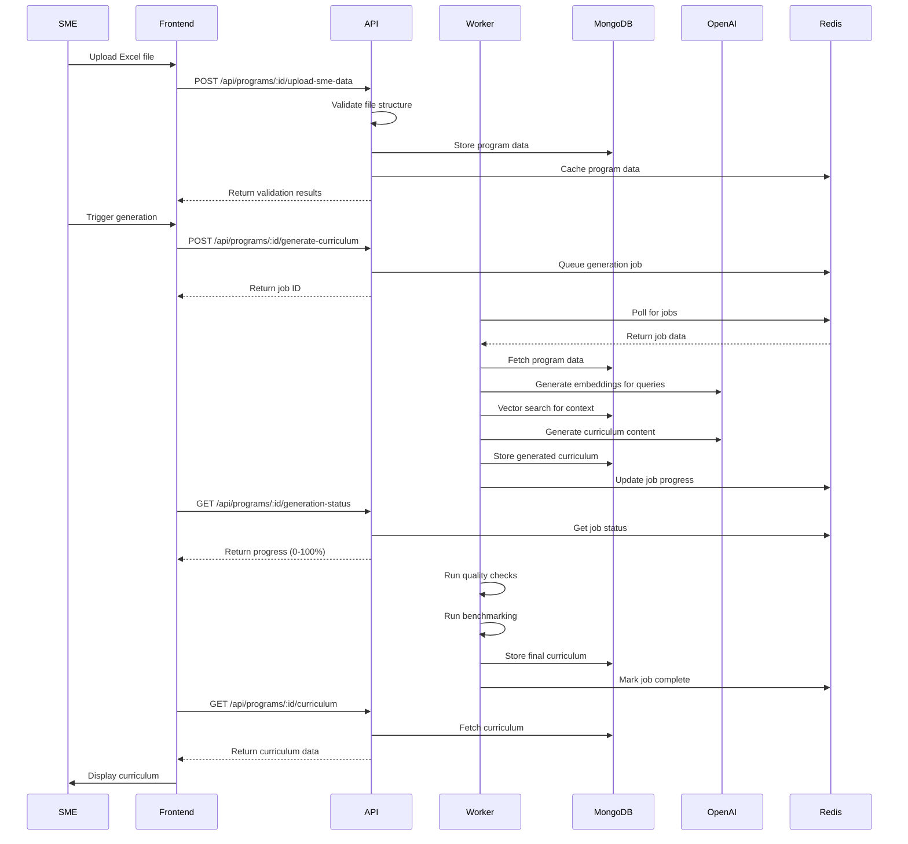
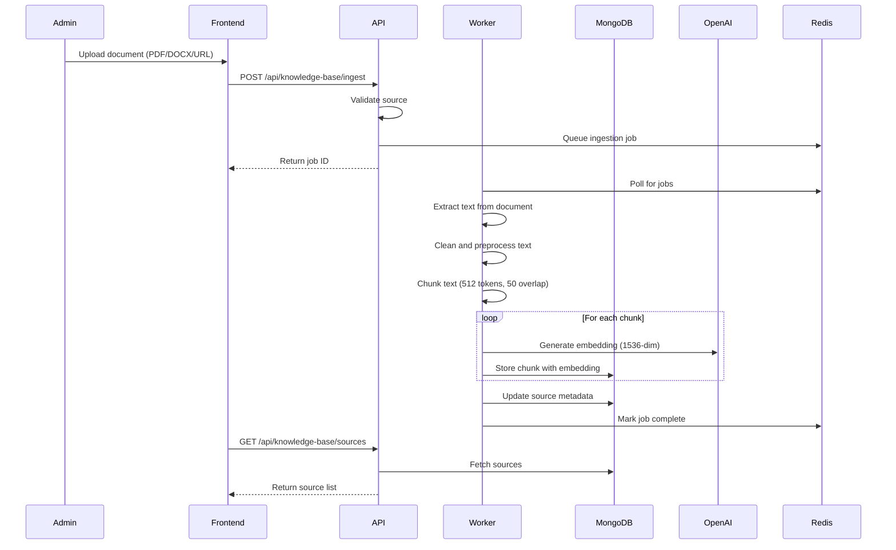
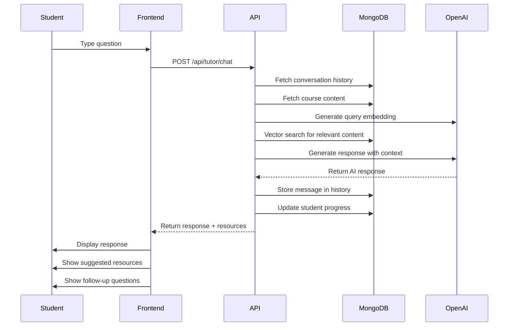
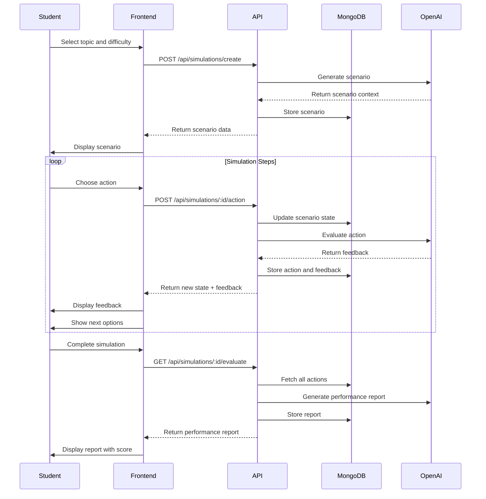

# Application Workflow Documentation

This document describes the complete workflows and processes in the Curriculum Generator App, from SME submission to final document export.

## Table of Contents

1. [Overview](#overview)
2. [User Roles](#user-roles)
3. [Main Workflows](#main-workflows)
4. [Detailed Process Flows](#detailed-process-flows)
5. [Data Flow Diagrams](#data-flow-diagrams)
6. [Integration Points](#integration-points)

## Overview

The Curriculum Generator App follows a multi-stage pipeline approach:

1. **Input Stage:** SME uploads Excel template with course data
2. **Validation Stage:** System validates structure and content
3. **Knowledge Retrieval Stage:** RAG engine retrieves relevant educational content
4. **Generation Stage:** AI generates curriculum documents
5. **Quality Assurance Stage:** Automated validation against standards
6. **Benchmarking Stage:** Comparison with competitor programs
7. **Review Stage:** Human review and adjustments
8. **Export Stage:** Generate final documents in multiple formats

## User Roles

### Administrator
- Manages system configuration
- Reviews and approves curricula
- Manages knowledge base
- Views analytics and reports
- Manages users and permissions

### Subject Matter Expert (SME)
- Uploads course content via Excel
- Reviews generated curricula
- Provides feedback and adjustments
- Approves final curriculum

### Student
- Interacts with tutor bot
- Completes simulations
- Accesses learning materials

## Main Workflows

### 1. Curriculum Generation Workflow



### 2. Knowledge Base Ingestion Workflow



### 3. Tutor Bot Interaction Workflow



### 4. Simulation Workflow



## Detailed Process Flows

### Excel Upload and Validation Process

**Step 1: File Upload**
```
1. User selects Excel file (.xlsx, max 50MB)
2. Frontend validates file type and size
3. File uploaded to API via multipart/form-data
4. API stores file in Render persistent disk
5. FileUpload record created in MongoDB
```

**Step 2: Structure Validation**
```
1. Parse Excel file using exceljs library
2. Check for 15 required sheets:
   - Program Overview
   - Competency Framework
   - Learning Outcomes
   - Course Framework
   - Topic Sources
   - Reading Lists
   - Assessments
   - Glossary
   - Case Studies
   - Delivery Specifications
   - (5 additional sheets)
3. Validate each sheet against JSON schema
4. Return detailed errors if validation fails
```

**Step 3: Data Extraction**
```
1. Extract data from each sheet
2. Transform to internal data models
3. Validate data types and constraints
4. Create Program document in MongoDB
5. Create related Module documents
6. Create LearningOutcome documents
7. Create Assessment documents
8. Return program ID and confirmation
```

### Curriculum Generation Pipeline

**Stage 1: Initialization (0-10%)**
```
1. Fetch program data from MongoDB
2. Fetch related modules and outcomes
3. Initialize generation job in Redis
4. Set job status to 'processing'
5. Emit progress event via WebSocket
```

**Stage 2: Context Retrieval (10-30%)**
```
For each module:
  1. Extract key topics from module title and aim
  2. Generate query embeddings using OpenAI
  3. Perform vector search in MongoDB
  4. Filter by similarity > 0.75
  5. Filter by recency (< 5 years)
  6. Rank by credibility score
  7. Select top 5-10 sources
  8. Store retrieved context
```

**Stage 3: Content Generation (30-70%)**
```
1. Generate Program Specification:
   - Introduction
   - Course overview
   - Needs analysis
   - Knowledge-skills-competencies matrix
   - Comparative analysis
   - Target audience
   - Entry requirements
   - Career outcomes

2. Generate Unit Specifications (parallel):
   For each module:
     - Unit overview table
     - Learning outcomes with criteria
     - Indicative content
     - Teaching strategies
     - Assessment methods
     - Reading lists

3. Generate Assessment Package:
   - 5-10 MCQs per module
   - Case study questions
   - Rubrics
   - Marking schemes
   - Outcome mappings
```

**Stage 4: Skill Book Generation (70-80%)**
```
1. Extract competency domains from program
2. For each competency:
   - Generate skill name and description
   - Create practical activities
   - Define measurable KPIs
   - Link to learning outcomes
   - Define assessment criteria
3. Store SkillMapping documents
```

**Stage 5: Quality Assurance (80-90%)**
```
1. Validate source recency
2. Check learning outcome structure:
   - Uses Bloom's taxonomy verbs
   - Follows Verb + Object + Context format
3. Validate program structure:
   - 5-8 program-level outcomes
   - 6-8 units per module
4. Validate hours:
   - Total = 120 hours
   - Balanced distribution
5. Check APA 7 citations
6. Generate QA report with issues and recommendations
```

**Stage 6: Benchmarking (90-100%)**
```
1. Fetch competitor programs from MongoDB
2. For each competitor:
   - Calculate topic similarity using embeddings
   - Compare assessment alignment
   - Compare structure
3. Identify content gaps
4. Identify strengths
5. Generate improvement recommendations
6. Store benchmark report
```

**Stage 7: Finalization (100%)**
```
1. Store complete curriculum in MongoDB
2. Update GenerationJob status to 'completed'
3. Clear intermediate results from Redis
4. Emit completion event via WebSocket
5. Send notification to SME
```

### RAG Engine Process

**Query Processing**
```
1. Receive query text (e.g., "business intelligence fundamentals")
2. Generate 3 query variations:
   - Original: "business intelligence fundamentals"
   - Expanded: "What are the key concepts of business intelligence?"
   - Detailed: "Explain business intelligence fundamentals in detail"
3. Generate embeddings for all queries
```

**Vector Search**
```
For each query embedding:
  1. Execute MongoDB $vectorSearch aggregation
  2. Set numCandidates = 100
  3. Set limit = 10
  4. Add similarity score to results
  5. Filter by similarity >= 0.75
  6. Filter by domain (if specified)
  7. Filter by publication date >= 5 years ago
  8. Sort by credibility score DESC, similarity DESC
```

**Result Processing**
```
1. Merge results from all queries
2. Deduplicate by content hash
3. Re-rank using cross-encoder (optional)
4. Limit to top 10 results
5. Extract content and metadata
6. Format for LLM context
```

**Content Generation**
```
1. Build prompt with:
   - System instructions
   - Retrieved context
   - User query
   - Output format requirements
2. Call OpenAI GPT-4-turbo
3. Parse response
4. Extract source references
5. Generate APA 7 citations
6. Return content with attributions
```

### Quality Assurance Checks

**Source Validation**
```
For each source:
  ✓ Publication date within 5 years (or marked exception)
  ✓ Credibility score >= 60
  ✓ Not from excluded domains (Wikipedia, blogs)
  ✓ Has proper metadata (title, author, date)
```

**Learning Outcome Validation**
```
For each outcome:
  ✓ Starts with Bloom's taxonomy verb
  ✓ Contains clear object (what students will do)
  ✓ Includes context (under what conditions)
  ✓ Is measurable
  ✓ Is at appropriate cognitive level
```

**Structure Validation**
```
Program level:
  ✓ Has 5-8 learning outcomes
  ✓ Has 5-8 modules
  ✓ Total hours = 120
  
Module level:
  ✓ Has 6-8 units
  ✓ Hours are balanced
  ✓ Has assessments mapped to outcomes
```

**Citation Validation**
```
For each citation:
  ✓ Follows APA 7 format
  ✓ Has all required elements
  ✓ Matches source in knowledge base
  ✓ Is properly formatted
```

### Document Export Process

**DOCX Generation**
```
1. Load DOCX template
2. Replace placeholders with data:
   - Program name, level, type
   - Learning outcomes
   - Module details
   - Assessment information
3. Apply formatting:
   - Headers and footers
   - Page numbers
   - Table of contents
   - Styles and fonts
4. Generate file buffer
5. Return for download
```

**PDF Generation**
```
1. Render HTML template with data
2. Apply CSS styling
3. Use Puppeteer to convert HTML to PDF
4. Set PDF options:
   - Page size: A4
   - Margins: 1 inch
   - Header/footer
5. Generate file buffer
6. Return for download
```

**SCORM Package Generation**
```
1. Create SCORM manifest (imsmanifest.xml)
2. Package curriculum content as SCOs
3. Add SCORM API wrapper
4. Include metadata
5. Zip all files
6. Return package for download
```

## Data Flow Diagrams

### Program Creation Data Flow

```
Excel File
    ↓
[Upload Service]
    ↓
[Validation]
    ↓
[Parser]
    ↓
[Data Transformation]
    ↓
MongoDB Collections:
    - programs
    - modules
    - learningOutcomes
    - assessments
    ↓
[Confirmation Response]
```

### Curriculum Generation Data Flow

```
Program ID
    ↓
[Job Queue] → Redis
    ↓
[Worker Process]
    ↓
[Fetch Program Data] ← MongoDB
    ↓
[Generate Queries]
    ↓
[Generate Embeddings] → OpenAI
    ↓
[Vector Search] ← MongoDB (knowledgeBase)
    ↓
[Retrieve Context]
    ↓
[Generate Content] → OpenAI (GPT-4)
    ↓
[Quality Checks]
    ↓
[Benchmarking] ← MongoDB (competitorPrograms)
    ↓
[Store Curriculum] → MongoDB
    ↓
[Update Job Status] → Redis
    ↓
[Notify Frontend] → WebSocket
```

### Knowledge Base Ingestion Data Flow

```
Document (PDF/DOCX/URL)
    ↓
[Text Extraction]
    ↓
[Cleaning & Preprocessing]
    ↓
[Chunking] (512 tokens, 50 overlap)
    ↓
[Batch Processing]
    ↓
[Generate Embeddings] → OpenAI (text-embedding-3-large)
    ↓
[Store in MongoDB]
    - content
    - embedding (1536-dim)
    - metadata
    ↓
[Create Vector Index] → MongoDB Atlas Search
    ↓
[Confirmation]
```

## Integration Points

### External Services

**OpenAI API**
- **Endpoint:** https://api.openai.com/v1/
- **Authentication:** Bearer token (API key)
- **Rate Limits:** 
  - GPT-4: 10,000 TPM (tokens per minute)
  - Embeddings: 1,000,000 TPM
- **Retry Strategy:** Exponential backoff (3 attempts)
- **Timeout:** 30 seconds

**Auth0**
- **Endpoint:** https://YOUR_DOMAIN.auth0.com/
- **Authentication:** OAuth 2.0 / JWT
- **Token Validation:** RS256 signature verification
- **Token Refresh:** Automatic via Auth0 SDK
- **Session Duration:** 30 minutes

**MongoDB Atlas**
- **Connection:** MongoDB URI with connection pooling
- **Authentication:** SCRAM-SHA-256
- **Connection Pool:** 5-20 connections
- **Timeout:** 45 seconds
- **Retry Writes:** Enabled

**Render Redis**
- **Connection:** Redis URL
- **Authentication:** Password-based
- **Connection Pool:** 10 connections
- **Timeout:** 5 seconds
- **Retry Strategy:** 3 attempts

### Internal Service Communication

**Frontend ↔ API**
- **Protocol:** HTTPS/REST
- **Format:** JSON
- **Authentication:** JWT in Authorization header
- **Error Handling:** Standard HTTP status codes

**API ↔ Worker**
- **Protocol:** Redis pub/sub + Bull queue
- **Format:** JSON job data
- **Reliability:** Job persistence in Redis
- **Retry:** Automatic with exponential backoff

**API ↔ MongoDB**
- **Protocol:** MongoDB wire protocol
- **Driver:** Mongoose ODM
- **Connection:** Persistent connection pool
- **Transactions:** Supported for multi-document operations

## Performance Considerations

### Optimization Strategies

**Caching**
- API responses: 5 minutes
- Knowledge base queries: 1 hour
- Generated content: 24 hours
- User sessions: 30 minutes

**Batch Processing**
- Embeddings: 100 texts per batch
- Database inserts: Bulk operations
- Vector searches: Parallel queries

**Async Processing**
- Curriculum generation: Background jobs
- Document ingestion: Background jobs
- Email notifications: Background jobs

**Database Optimization**
- Indexes on frequently queried fields
- Projection to limit returned fields
- Pagination for large result sets
- Aggregation pipelines for complex queries

### Scalability

**Horizontal Scaling**
- API servers: Multiple instances behind load balancer
- Workers: Scale based on queue depth
- MongoDB: Replica set with read replicas

**Vertical Scaling**
- Increase API server resources for higher throughput
- Increase worker resources for faster job processing
- Upgrade MongoDB cluster tier for better performance

This workflow documentation provides a complete understanding of how data flows through the Curriculum Generator App and how different components interact to deliver the final curriculum documents.
