# Curriculum Generator - Complete Workflow Document

## Executive Summary

The **Curriculum Generator** is an intelligent, full-stack platform designed to automatically generate comprehensive academic curricula using advanced AI technology combined with human expertise. The system combines Retrieval-Augmented Generation (RAG) technology with large language models to produce high-quality educational content while ensuring quality assurance and competitive benchmarking.

---

## Table of Contents

1. [Application Overview](#application-overview)
2. [System Architecture](#system-architecture)
3. [Curriculum Generation Workflow](#curriculum-generation-workflow)
4. [Data Flow & Components](#data-flow--components)
5. [User Interaction Flows](#user-interaction-flows)
6. [Quality Assurance Process](#quality-assurance-process)
7. [Technology Stack](#technology-stack)

---

## Application Overview

### What is the Curriculum Generator?

The Curriculum Generator is a comprehensive educational platform that:

- **Automates curriculum creation** from initial program specifications
- **Leverages knowledge databases** to enrich generated content with credible sources
- **Generates learning outcomes, assessments, and teaching materials** for academic programs
- **Validates quality** against industry standards (AGCQ compliance)
- **Benchmarks programs** against competitor institutions
- **Provides student support** through AI tutoring and simulation scenarios
- **Exports materials** in multiple formats (PDF, DOCX, ZIP packages)

### Key Capabilities

| Capability | Description |
|------------|-------------|
| **Program Creation** | Define academic programs with module structures, credit hours, and qualification types |
| **Curriculum Generation** | Automatically generate complete curricula from program specifications |
| **Knowledge Base Management** | Ingest and manage educational documents with semantic search capabilities |
| **Learning Outcomes** | Generate aligned learning outcomes with assessment criteria and Bloom's taxonomy levels |
| **Assessment Package** | Create MCQs, case studies, rubrics, and marking schemes |
| **Skill Mapping** | Link practical activities, KPIs, and competencies to learning outcomes |
| **Quality Validation** | Validate sources, citations, hours distribution, and curriculum structure |
| **Competitive Analysis** | Benchmark programs against competitor institutions |
| **AI Tutoring** | Provide interactive AI-powered tutor for student engagement |
| **Simulations** | Offer practical simulation scenarios for hands-on learning |

---

## System Architecture

### High-Level Architecture Overview

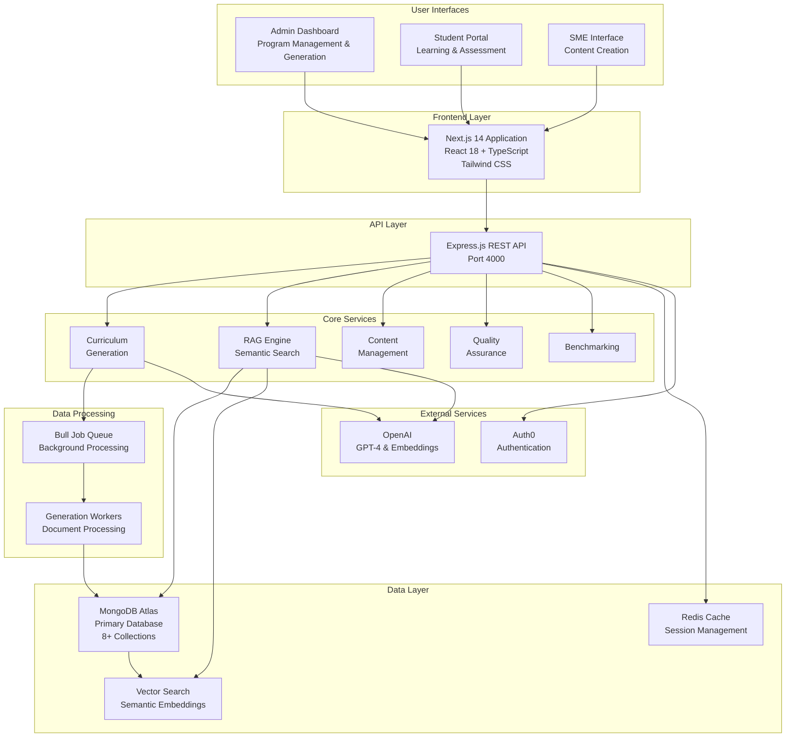

### Technology Stack

**Frontend:**
- Next.js 14 with App Router
- React 18 with TypeScript
- Tailwind CSS for styling
- React Query for server state management
- Zustand for client state management

**Backend:**
- Express.js on Node.js 18+
- TypeScript for type safety
- Mongoose for database ODM
- Bull for job queue management

**Databases & Caching:**
- MongoDB Atlas (primary database)
- MongoDB Vector Search (semantic search)
- Redis (caching and session management)

**AI & ML:**
- OpenAI GPT-4-turbo (content generation)
- OpenAI text-embedding-3-large (semantic embeddings)

**Authentication:**
- Auth0 (OAuth provider)
- JWT tokens for API authentication

**Infrastructure & Deployment:**
- Render (application hosting)
- Disk storage (file uploads)
- Cloudinary (image storage, optional)
- Sentry (error tracking)
- Winston (logging)

---

## Curriculum Generation Workflow

### The 8-Stage Generation Pipeline

The curriculum generation process is a sophisticated 8-stage pipeline that transforms a program specification into a complete, validated curriculum. Each stage builds upon the previous one, progressively adding detail and validation.

```mermaid
graph LR
    Input["Program Specification<br/>Input"] -->|Stage 1| V["Validation<br/>5%"]
    V -->|Stage 2| KB["Knowledge Base<br/>Retrieval<br/>15%"]
    KB -->|Stage 3| PS["Program<br/>Specification<br/>30%"]
    PS -->|Stage 4| US["Unit<br/>Specifications<br/>50%"]
    US -->|Stage 5| AP["Assessment<br/>Package<br/>65%"]
    AP -->|Stage 6| SB["Skill Book<br/>75%"]
    SB -->|Stage 7| QA["Quality<br/>Assurance<br/>85%"]
    QA -->|Stage 8| BM["Benchmarking<br/>95%"]
    BM --> Output["Complete<br/>Curriculum<br/>100%"]

    style Input fill:#e1f5ff
    style V fill:#fff3e0
    style KB fill:#fff3e0
    style PS fill:#f3e5f5
    style US fill:#f3e5f5
    style AP fill:#f3e5f5
    style SB fill:#f3e5f5
    style QA fill:#c8e6c9
    style BM fill:#c8e6c9
    style Output fill:#e1f5ff
```

### Stage 1: Validation (5% Progress)

**What Happens:**
The system validates the input program data to ensure completeness and correctness before proceeding with generation.

**Process:**
- Checks program structure and required fields
- Validates module definitions (codes, titles, hours)
- Verifies Excel file format if template upload is used
- Confirms database connectivity and data integrity
- Validates configuration settings for content generation

**Output:**
- Validation status (passed/failed)
- List of any validation errors or warnings
- Ready signal to proceed to next stage

**Why It Matters:**
Ensures data quality from the start, preventing errors from propagating through the generation pipeline.

---

### Stage 2: Knowledge Base Retrieval (15% Progress)

**What Happens:**
The system retrieves relevant, credible educational content from the knowledge base to inform curriculum generation. This is the foundation of the RAG (Retrieval-Augmented Generation) approach.

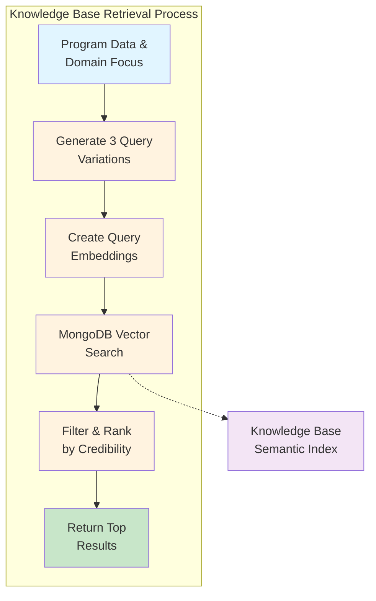

**Process:**
1. **Query Generation**: Creates 3 semantic variations of program domain/topic to improve retrieval
2. **Embedding Creation**: Converts queries to numerical embeddings (1536 dimensions)
3. **Vector Search**: Performs MongoDB Atlas Vector Search across all knowledge base documents
4. **Filtering**: Applies multiple quality filters:
   - Similarity score threshold (≥0.75)
   - Domain relevance
   - Credibility score (0-100)
   - Publication date recency
5. **Ranking**: Re-ranks results by combined credibility and relevance score
6. **Retrieval**: Returns top-ranked documents with citations

**Data Retrieved:**
- Research papers and academic sources
- Industry reports and standards
- Textbook excerpts and educational materials
- Case studies and real-world examples
- Assessment frameworks and learning outcome standards

**Why It Matters:**
By grounding generation in credible sources, the system ensures curriculum content is evidence-based and can be properly cited.

---

### Stage 3: Program Specification Generation (30% Progress)

**What Happens:**
Using retrieved knowledge as context, the system generates the foundational specification document for the entire program.

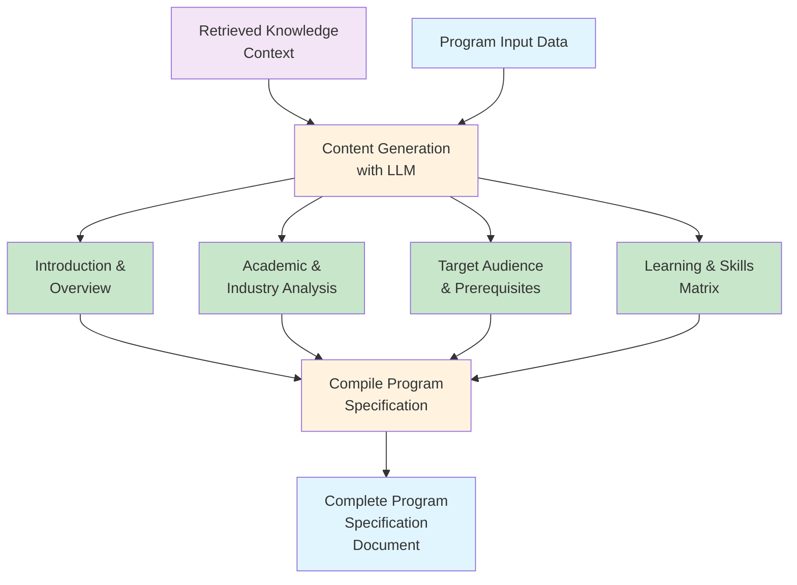

**What Gets Generated:**

| Component | Description |
|-----------|-------------|
| **Program Introduction** | Overview of the program's purpose, significance, and value proposition |
| **Course Overview** | High-level summary of program structure and learning pathway |
| **Needs Analysis** | Market and industry analysis justifying the program |
| **Knowledge/Skills/Competencies Matrix** | Mapping of what students will learn, skills they'll gain, and competencies they'll develop |
| **Comparative Analysis** | How this program compares to similar offerings in the market |
| **Target Audience** | Profile of intended students and their background |
| **Entry Requirements** | Prerequisites and admission criteria |
| **Career Outcomes** | Career paths and job opportunities for graduates |

**Why It Matters:**
Establishes the strategic foundation and context for all subsequent curriculum components.

---

### Stage 4: Unit Specifications Generation (50% Progress)

**What Happens:**
For each module in the program, the system generates a comprehensive specification defining learning outcomes, content, teaching strategies, and assessment methods.

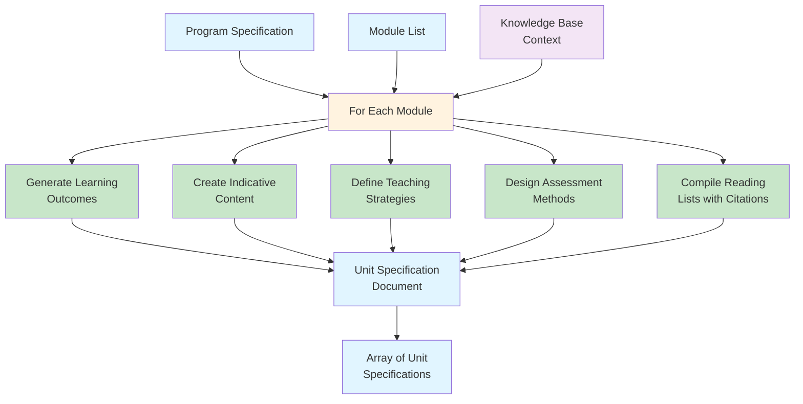

**What Gets Generated Per Module:**

| Element | Description |
|---------|-------------|
| **Unit Overview** | Brief description of module purpose and scope |
| **Learning Outcomes** | Specific, measurable outcomes students must achieve (aligned to Bloom's taxonomy) |
| **Assessment Criteria** | Detailed criteria for evaluating learning outcome achievement |
| **Indicative Content** | Topics, concepts, and material to be covered |
| **Teaching Strategies** | Recommended pedagogical approaches and delivery methods |
| **Assessment Methods** | Types of assessments used (exams, projects, presentations) |
| **Reading Lists** | Curated sources with full citations in APA 7 format |
| **Practical Activities** | Hands-on exercises and projects |
| **Duration & Credit Hours** | Time allocation per module |

**Why It Matters:**
Provides detailed guidance for educators while ensuring consistency across all modules in the program.

---

### Stage 5: Assessment Package Generation (65% Progress)

**What Happens:**
The system generates a complete assessment package including different question types, grading rubrics, and marking schemes aligned with learning outcomes.

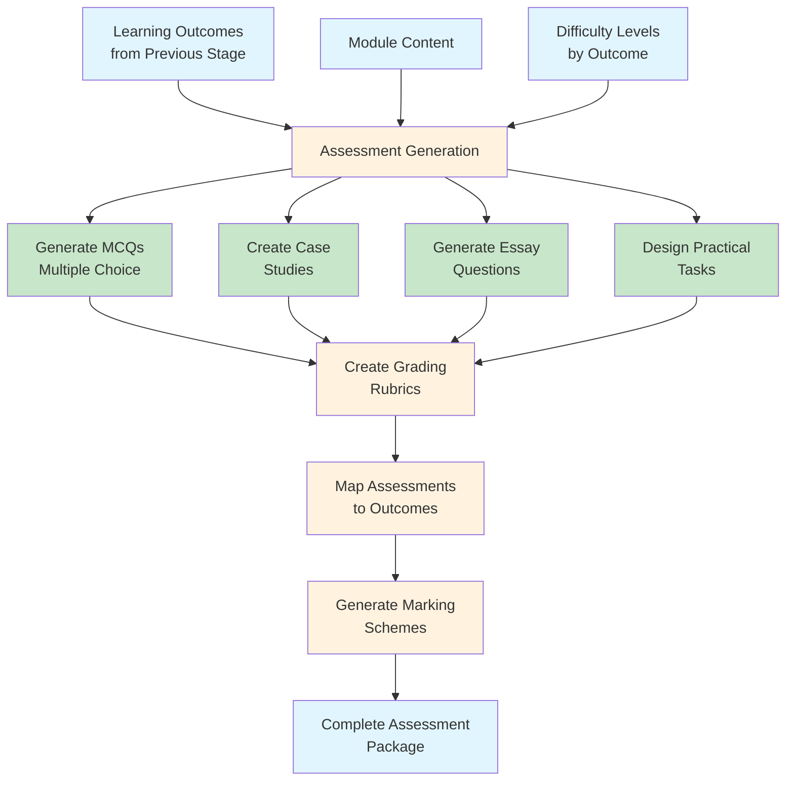

**Assessment Components Generated:**

| Type | Purpose | Example |
|------|---------|---------|
| **MCQs** | Quick knowledge checks and formative assessment | "Which of the following best describes X?" |
| **Case Studies** | Apply knowledge to real-world scenarios | Multi-part analysis of business situation |
| **Essay Questions** | Assess deeper understanding and critical thinking | "Analyze the implications of..." |
| **Practical Tasks** | Hands-on skills application | Lab exercises, projects, simulations |
| **Grading Rubrics** | Standardized evaluation criteria | Point allocation, quality descriptors |
| **Marking Schemes** | Detailed answer keys and grading guidance | Sample answers with point values |

**Why It Matters:**
Provides educators with ready-to-use assessment materials that are directly aligned with learning outcomes.

---

### Stage 6: Skill Book Generation (75% Progress)

**What Happens:**
The system maps practical activities to specific skills and defines Key Performance Indicators (KPIs) for measuring skill development.

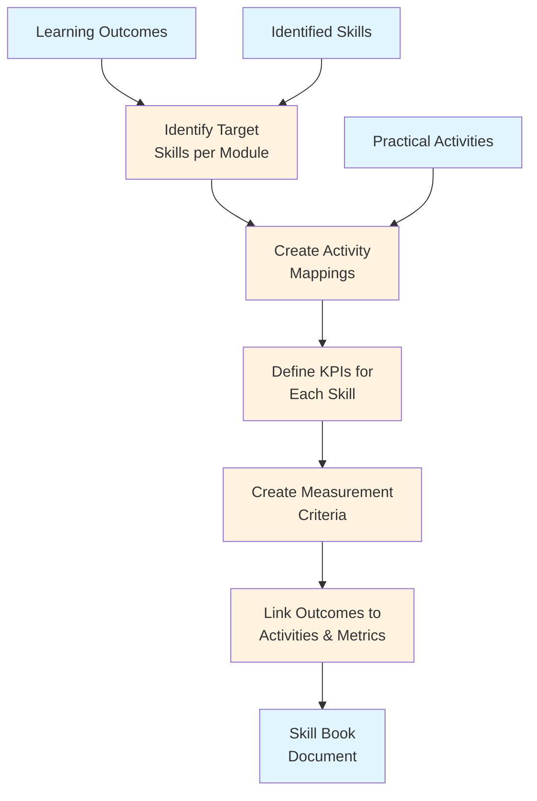

**Skill Book Components:**

| Component | Description |
|-----------|-------------|
| **Skill Identification** | Extract specific skills from learning outcomes (e.g., "Data Analysis", "Project Management") |
| **Activity Mapping** | Link practical activities and projects to each skill |
| **Duration** | Hours allocated to develop each skill |
| **Assessment Type** | How skill proficiency is measured |
| **Resource List** | Tools, software, and materials needed |
| **KPI Definition** | Measurable indicators of skill mastery |
| **Performance Thresholds** | Expected performance levels (e.g., "80% accuracy") |

**Why It Matters:**
Bridges the gap between theoretical learning outcomes and practical skill development, enabling employers to understand graduate capabilities.

---

### Stage 7: Quality Assurance (85% Progress)

**What Happens:**
The system validates the generated curriculum against multiple quality standards and generates a comprehensive QA report.

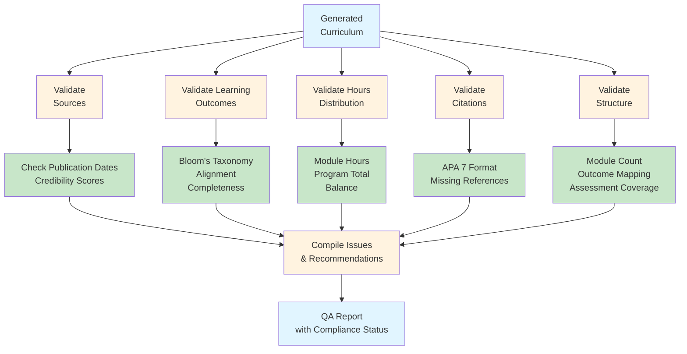

**QA Validations Performed:**

| Validation | Checks | Standards |
|-----------|--------|-----------|
| **Source Quality** | Publication date, credibility score, domain relevance | Prefer sources < 5 years old, credibility > 75 |
| **Learning Outcomes** | Bloom's taxonomy levels, specificity, measurability | Aligned to appropriate cognitive levels for program |
| **Hours Distribution** | Module hours total to program credits, balanced load | Compliance with degree requirements |
| **Citations** | Format compliance, completeness, proper attribution | APA 7 standard format |
| **Structure Validation** | Module count, outcome-to-assessment mapping, coverage | Complete and coherent program structure |

**QA Report Output:**
- List of issues found with severity levels (critical, major, minor)
- Recommendations for improvement
- Compliance percentage (0-100%)
- Detailed explanations of each issue

**Why It Matters:**
Ensures curriculum meets industry standards before publication, protecting institutional reputation and student outcomes.

---

### Stage 8: Benchmarking (95% Progress)

**What Happens:**
The system compares the generated program against competitor institutions to identify strengths and content gaps.

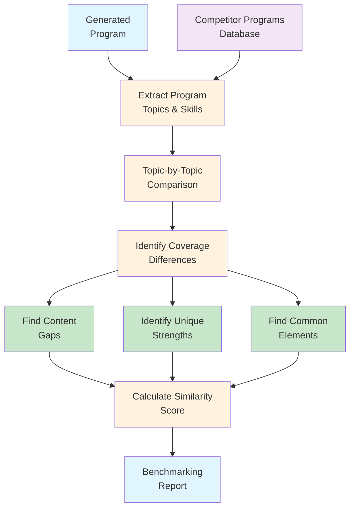

**Benchmarking Analysis Includes:**

| Metric | Description |
|--------|-------------|
| **Content Gaps** | Topics covered by competitors but missing from generated program |
| **Unique Strengths** | Topics in generated program not found in competitor programs |
| **Common Elements** | Standard topics found across most programs (industry consensus) |
| **Coverage %** | Percentage of industry-standard topics included |
| **Similarity Score** | How similar this program is to competitors (0-100%) |
| **Differentiation** | What makes this program distinct |
| **Recommendations** | Suggested topics to add or modify |

**Why It Matters:**
Ensures the program is competitive and market-relevant while identifying opportunities to differentiate.

---

### Final Stage: Completion & Notification

**What Happens:**
After all 8 stages complete, the system finalizes the generation job and notifies users.

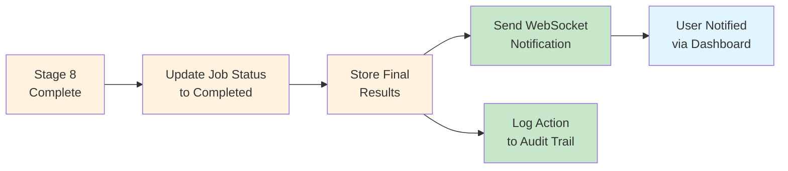

**Final Actions:**
1. Update generation job status to "completed"
2. Store complete curriculum in database
3. Send real-time WebSocket notification to dashboard
4. Record action in audit log with timestamp
5. Make curriculum available for download and export

---

## Data Flow & Components

### Core Components & Their Roles

#### 1. Curriculum Generator Service

**Responsibility:** Orchestrates the entire 8-stage generation pipeline

**Functions:**
- Receives generation request from API endpoint
- Creates a generation job record
- Sends initial WebSocket notification
- Executes each stage sequentially
- Updates progress after each stage
- Handles errors and logging
- Triggers background workers for long-running tasks

**Workflow:**
```
User Request → Validate Input → Create Job Record →
Start Background Processing → Monitor Progress →
Send Updates via WebSocket → Handle Completion/Errors
```

---

#### 2. RAG (Retrieval-Augmented Generation) Engine

**Responsibility:** Retrieves relevant context from knowledge base for content generation

**Key Features:**
- **Multi-Query Retrieval**: Creates 3 semantic variations to improve coverage
- **Vector Search**: Uses MongoDB Atlas Vector Search for semantic similarity
- **Relevance Filtering**: Applies domain, credibility, and recency filters
- **Result Ranking**: Combines multiple scoring factors for optimal ranking
- **Citation Tracking**: Maintains source attribution for generated content

**Process:**
```
Input Query → Generate Embeddings → Semantic Search →
Filter Results → Re-rank by Score → Return with Citations
```

---

#### 3. Content Generation Service

**Responsibility:** Generates curriculum content using LLM with RAG context

**Functions:**
- Receives generation requests with context
- Manages prompt templates for different content types
- Calls OpenAI GPT-4 API
- Processes LLM responses
- Formats output for storage
- Implements caching for repeated requests

**Content Types:**
- Program specifications and overviews
- Unit descriptions and learning outcomes
- Assessment items and rubrics
- Reading lists and citations
- Skill descriptions and KPI definitions

---

#### 4. Vector Search Service

**Responsibility:** Manages semantic search across knowledge base

**Features:**
- MongoDB Atlas Vector Search integration
- Document similarity scoring
- Domain-based filtering
- Credibility score ranking
- Recency weighting (prefer recent publications)
- Configurable similarity threshold (default: 0.75)

**Workflow:**
```
Query → Create Embedding → Execute Vector Search →
Apply Filters → Calculate Combined Scores → Return Results
```

---

#### 5. Embedding Service

**Responsibility:** Converts text to vector embeddings for semantic search

**Process:**
1. **Document Chunking**: Splits documents into 512-token chunks with 50-token overlap
2. **Batch Processing**: Groups chunks for efficient API calls
3. **Embedding Generation**: Calls OpenAI text-embedding-3-large model
4. **Storage**: Stores 1536-dimensional vectors in MongoDB
5. **Caching**: Reuses embeddings to minimize API calls

**Output:**
- Numerical vectors (1536 dimensions) representing document meaning
- Metadata tracking (chunk position, document source, creation date)

---

#### 6. Quality Assurance Service

**Responsibility:** Validates curriculum against quality standards

**Validation Types:**

| Type | Checks |
|------|--------|
| **Source Validation** | Credibility scores, publication dates within acceptable ranges |
| **Learning Outcome Validation** | Alignment to Bloom's taxonomy, specificity, measurability |
| **Hours Distribution** | Total hours match program requirements, reasonable per-module allocation |
| **Citation Validation** | APA 7 format compliance, no missing references |
| **Structure Validation** | Complete module set, outcome-to-assessment mapping, no gaps |

**Output:**
- QA Report with detailed findings
- Severity levels for each issue
- Recommendations for improvement
- Overall compliance score

---

#### 7. Benchmarking Service

**Responsibility:** Compares generated program with competitor offerings

**Analysis Includes:**
- Topic-by-topic comparison with competitor programs
- Content gap identification
- Unique strength identification
- Similarity scoring
- Competitive positioning

**Output:**
- Benchmark report with detailed comparisons
- Gap analysis with recommendations
- Strength analysis highlighting differentiation

---

### Knowledge Base Management

The knowledge base is the foundation for RAG-enhanced curriculum generation.

```mermaid
graph TB
    subgraph "Knowledge Base Lifecycle"
        Input["Document Input<br/>PDF, DOCX, URL, Manual"]
        Validation["Credibility Assessment<br/>Source Verification"]
        Processing["Text Extraction<br/>Content Cleaning"]
        Chunking["Text Chunking<br/>512 tokens + overlap"]
        Embedding["Embedding Generation<br/>OpenAI API"]
        Storage["MongoDB Storage<br/>with Vectors"]
        Index["Vector Search<br/>Index Creation"]
        Ready["Ready for<br/>Retrieval"]
    end

    Input --> Validation
    Validation --> Processing
    Processing --> Chunking
    Chunking --> Embedding
    Embedding --> Storage
    Storage --> Index
    Index --> Ready

    style Input fill:#e1f5ff
    style Validation fill:#fff3e0
    style Processing fill:#fff3e0
    style Chunking fill:#fff3e0
    style Embedding fill:#fff3e0
    style Storage fill:#c8e6c9
    style Index fill:#c8e6c9
    style Ready fill:#e1f5ff
```

**Knowledge Base Metadata:**
- Source URL or document name
- Source type (PDF, DOCX, URL, manual)
- Publication date
- Domain/subject area
- Credibility score (0-100)
- Full text chunks with embeddings
- Creation timestamp

---

### Job Queue System

Background processing is managed through a Bull job queue for scalability.

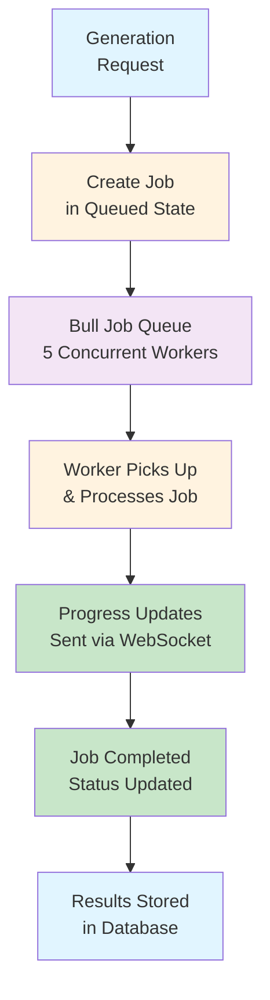

**Job Queue Features:**
- **Concurrency**: 5 simultaneous generation jobs
- **Retry Policy**: Up to 3 attempts with exponential backoff
- **Timeout**: 5-minute timeout per job
- **Progress Tracking**: Updates every stage
- **Real-time Notifications**: WebSocket updates to connected clients

---

## User Interaction Flows

### Flow 1: Admin Creates New Program

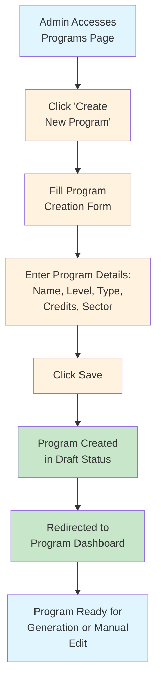

---

### Flow 2: Admin Uploads Excel Template & Triggers Generation

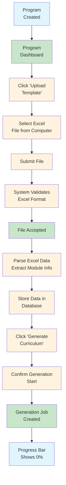

---

### Flow 3: Curriculum Generation In Progress

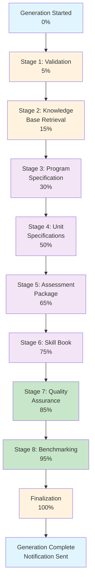

**Real-time Updates:**
- Progress bar updates in UI
- WebSocket notifications every stage
- User can monitor without page refresh
- No blocking - user can continue browsing while generation completes

---

### Flow 4: Reviewing Generated Curriculum

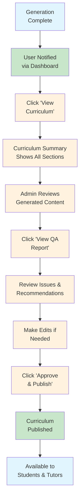

---

### Flow 5: Student Accessing Course Materials & Tutor Bot

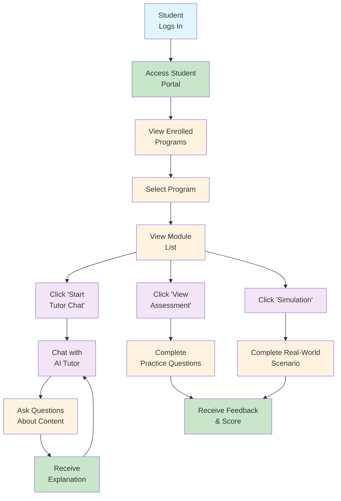

---

### Flow 6: Exporting Curriculum

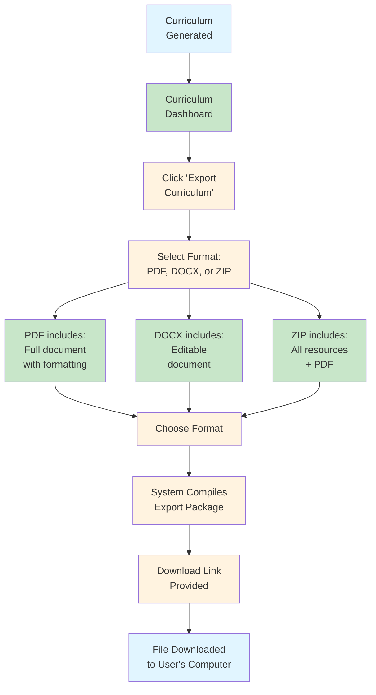

---

## Quality Assurance Process

### QA Report Structure

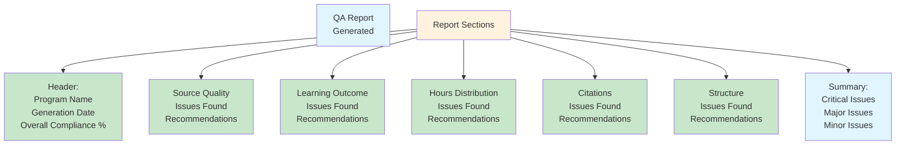

### Issue Categories & Resolution

| Issue Type | Example | Severity | Resolution |
|-----------|---------|----------|-----------|
| **Source Quality** | Source from 2010 in field with rapid changes | Major | Update with more recent sources |
| **Missing Outcomes** | Module has no assessment criteria | Critical | Add specific, measurable criteria |
| **Hours Imbalance** | Module has 40 hours, others have 5-10 | Major | Rebalance to 10-15 hour range |
| **Citation Format** | References use Chicago style not APA 7 | Minor | Reformat to APA 7 |
| **Outcome Clarity** | Learning outcome too vague ("understand X") | Major | Make specific and measurable ("analyze X") |
| **Missing Assessment** | No assessment method defined for outcome | Critical | Assign assessment type |

---

## Key Performance Indicators (KPIs)

### Generation Performance

| KPI | Description | Target |
|-----|-------------|--------|
| **Generation Success Rate** | % of generation jobs that complete successfully | > 95% |
| **Average Generation Time** | Average time to complete full 8-stage pipeline | < 15 minutes |
| **Quality Compliance Score** | % of curricula passing QA validation | > 85% |
| **Source Attribution** | % of content with proper citations | 100% |

### User Engagement

| KPI | Description | Target |
|-----|-------------|--------|
| **Student Portal Usage** | Monthly active students | Increasing |
| **Tutor Bot Interactions** | Questions asked per student per module | > 5/month |
| **Simulation Completion** | % students completing simulations | > 70% |
| **Assessment Completion** | % students completing practice assessments | > 60% |

### Content Quality

| KPI | Description | Target |
|-----|-------------|--------|
| **Bloom's Alignment** | % of outcomes at appropriate cognitive levels | > 95% |
| **Outcome-Assessment Mapping** | % of outcomes with aligned assessments | 100% |
| **Reading List Credibility** | Average credibility score of sources | > 80 |
| **Citation Compliance** | % of citations in correct format | 100% |

---

## Data Storage & Security

### Database Collections Overview

| Collection | Purpose | Records |
|-----------|---------|---------|
| **Programs** | Program definitions and metadata | Primary curriculum data |
| **Modules** | Module/unit specifications | Structured curriculum |
| **Learning Outcomes** | Learning outcome definitions | Assessment criteria |
| **Knowledge Base** | Ingested documents with embeddings | Vector search index |
| **Generation Jobs** | Curriculum generation job tracking | Progress monitoring |
| **Assessments** | Assessment items and rubrics | Testing materials |
| **Skill Mappings** | Skill-to-activity mappings | Practical outcomes |
| **Audit Logs** | User actions and system events | Compliance tracking |
| **File Uploads** | Uploaded documents metadata | File management |
| **Users** | User accounts and profiles | Access control |

### Caching Strategy

**Cache Layers:**
1. **API Response Cache** (5 minutes) - Program lists, analytics
2. **Knowledge Base Search Cache** (1 hour) - Vector search results
3. **Embedding Cache** - Prevents duplicate embeddings
4. **Session Cache** - User sessions via Redis
5. **Content Generation Cache** (24 hours) - LLM outputs

**Benefits:**
- Faster response times
- Reduced API costs
- Better user experience
- Reduced database load

---

## Integration Points

### External Services Integration

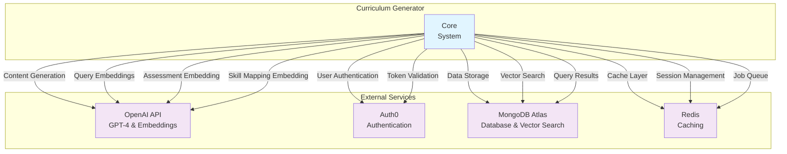

---

## Security & Authentication

### Authentication Flow

```mermaid
graph TB
    User["User"]
    Login["Access Login Page"]
    Auth0Page["Redirected to<br/>Auth0 Login"]
    Credentials["Enter Credentials"]
    Validate["Auth0 Validates<br/>Credentials"]
    Token["Issues JWT Token"]
    Redirect["Redirected to<br/>Dashboard"]
    Logged["User Logged In<br/>Token Stored"]

    User --> Login
    Login --> Auth0Page
    Auth0Page --> Credentials
    Credentials --> Validate
    Validate --> Token
    Token --> Redirect
    Redirect --> Logged

    style User fill:#e1f5ff
    style Login fill:#fff3e0
    style Auth0Page fill:#f3e5f5
    style Credentials fill:#fff3e0
    style Validate fill:#f3e5f5
    style Token fill:#f3e5f5
    style Redirect fill:#fff3e0
    style Logged fill:#c8e6c9
```

### Authorization

**Role-Based Access Control:**

| Role | Permissions |
|------|------------|
| **Administrator** | Create/edit/delete programs, trigger generation, view all reports, manage knowledge base, analytics access |
| **SME** | Create programs, review generated content, edit curriculum, provide source documents |
| **Student** | Access course materials, use tutor bot, complete assessments, view simulations |

---

## Error Handling & Recovery

### Error Scenarios & Recovery

```mermaid
graph TB
    Error["Error Occurs<br/>During Generation"]
    Catch["System Catches<br/>Error"]
    Log["Log Error with<br/>Context"]
    Notify["Notify User<br/>via Dashboard"]
    Retry["Attempt Retry<br/>Up to 3x"]
    RetrySuccess{Retry<br/>Successful?}
    UpdateStatus["Update Job Status<br/>to Failed"]
    Recommend["Provide Recovery<br/>Recommendations"]
    Store["Store Error<br/>in Database"]

    Error --> Catch
    Catch --> Log
    Log --> Notify
    Notify --> Retry
    Retry --> RetrySuccess
    RetrySuccess -->|Yes| UpdateStatus
    RetrySuccess -->|No| Recommend
    Recommend --> Store
    UpdateStatus --> Store

    style Error fill:#ffebee
    style Catch fill:#fff3e0
    style Log fill:#fff3e0
    style Notify fill:#fff3e0
    style Retry fill:#fff3e0
    style RetrySuccess fill:#fff3e0
    style UpdateStatus fill:#ffcdd2
    style Recommend fill:#fff3e0
    style Store fill:#ffcdd2
```

### Common Issues & Solutions

| Issue | Cause | Solution |
|-------|-------|----------|
| **Generation Timeout** | Complex program or slow AI response | Increase timeout, split generation |
| **Knowledge Base Gap** | Missing sources for domain | Ingest more relevant documents |
| **Low Quality Outcomes** | Insufficient RAG context | Improve source curation |
| **Citation Errors** | Malformed source metadata | Validate source data during ingestion |
| **Slow Vector Search** | Large knowledge base | Optimize MongoDB indexing |

---

## Monitoring & Analytics

### System Health Monitoring

```mermaid
graph TB
    System["System"]

    Health["Health Checks"]
    Perf["Performance Metrics"]
    Usage["Usage Analytics"]
    Quality["Quality Metrics"]

    System --> Health
    System --> Perf
    System --> Usage
    System --> Quality

    Health --> DB["Database<br/>Connection"]
    Health --> Redis["Redis<br/>Connection"]
    Health --> File["File Storage<br/>Availability"]
    Health --> AI["OpenAI API<br/>Availability"]

    Perf --> ReqTime["Request Duration<br/>Tracking"]
    Perf --> GenTime["Generation Time<br/>by Stage"]
    Perf --> QueueTime["Job Queue<br/>Processing Time"]

    Usage --> GenCount["Curricula<br/>Generated"]
    Usage --> UserCount["Active Users"]
    Usage --> APICount["API Calls<br/>by Endpoint"]

    Quality --> CompScore["Compliance<br/>Score"]
    Quality --> ErrorRate["Error Rate"]
    Quality --> SourceQual["Source Quality<br/>Average"]

    style System fill:#e1f5ff
    style Health fill:#fff3e0
    style Perf fill:#fff3e0
    style Usage fill:#fff3e0
    style Quality fill:#fff3e0
    style DB fill:#c8e6c9
    style Redis fill:#c8e6c9
    style File fill:#c8e6c9
    style AI fill:#c8e6c9
    style ReqTime fill:#c8e6c9
    style GenTime fill:#c8e6c9
    style QueueTime fill:#c8e6c9
    style GenCount fill:#c8e6c9
    style UserCount fill:#c8e6c9
    style APICount fill:#c8e6c9
    style CompScore fill:#c8e6c9
    style ErrorRate fill:#c8e6c9
    style SourceQual fill:#c8e6c9
```

### Analytics Dashboard Metrics

| Dashboard | Metrics |
|-----------|---------|
| **Overview** | Active users, curricula generated today, total programs, system health |
| **Generation Metrics** | Success rate, average generation time, current queue size, failure rate |
| **Quality Metrics** | Average compliance score, source quality average, citation compliance |
| **Usage Analytics** | API calls per endpoint, storage usage, AI API costs, knowledge base size |
| **Student Engagement** | Active students, tutor interactions, assessment completion, simulation usage |

---

## Conclusion

The **Curriculum Generator** is a comprehensive, AI-powered platform that democratizes high-quality curriculum development. By combining:

- **Advanced AI Technology** (GPT-4 and semantic embeddings)
- **Knowledge Base Management** (curated, credible sources)
- **Rigorous Quality Standards** (8-stage validation pipeline)
- **Competitive Analysis** (benchmarking against market offerings)
- **User-Friendly Interface** (intuitive admin and student portals)

The system enables institutions to:

✓ Generate complete, professional curricula in minutes (not months)
✓ Ensure quality and compliance through automated validation
✓ Stay competitive through benchmarking and gap analysis
✓ Engage students through AI tutoring and simulations
✓ Maintain audit trails for compliance and accountability

The architecture is designed for scalability, reliability, and maintainability, supporting institutional needs from small programs to large-scale curriculum development initiatives.

---

**Document Version:** 1.0
**Last Updated:** October 28, 2025
**Purpose:** Product Manager Communication & Stakeholder Overview
