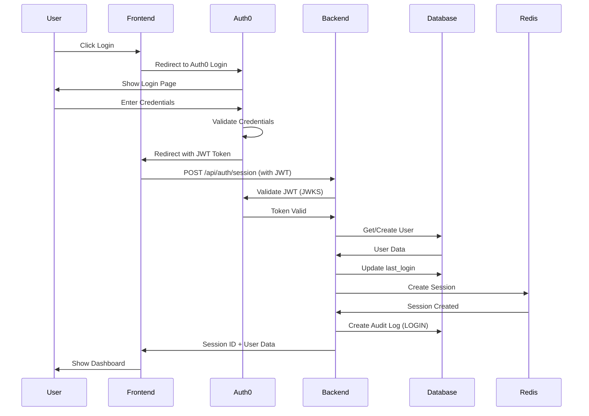
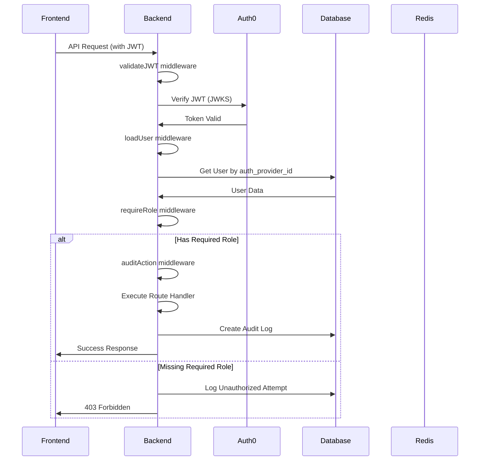
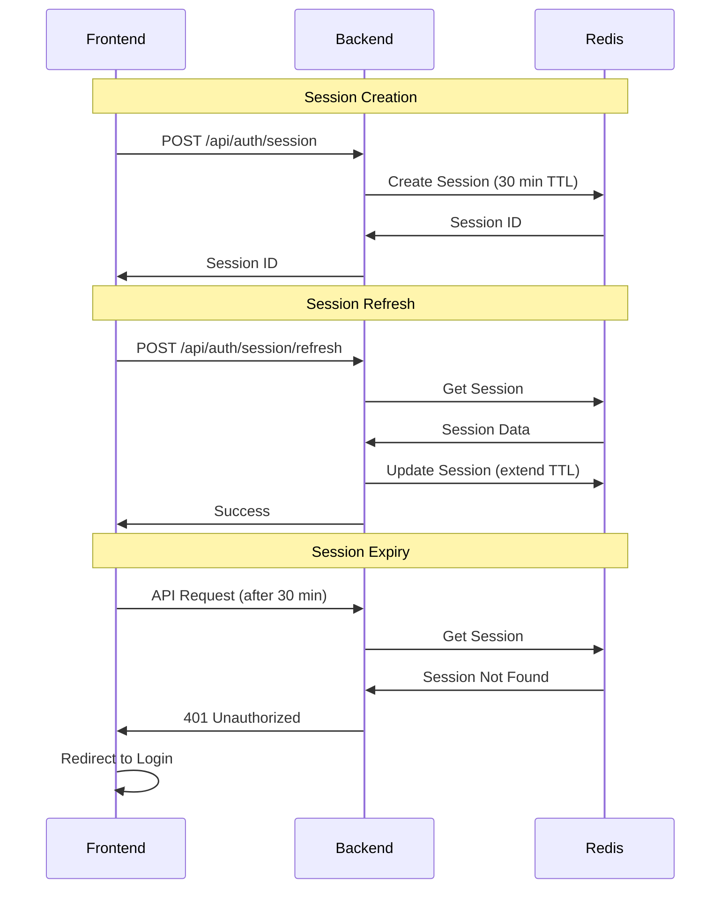
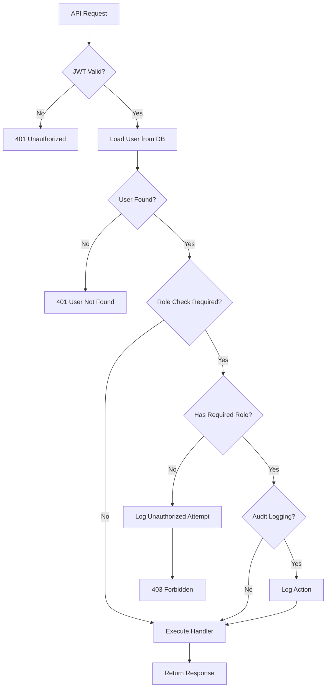
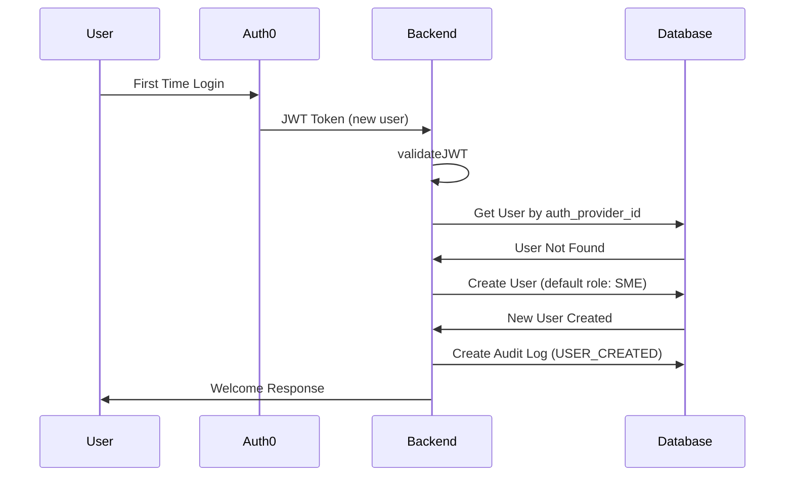
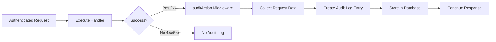
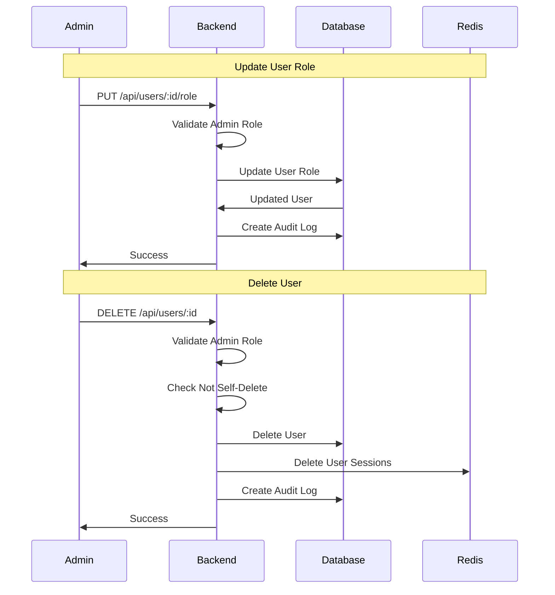
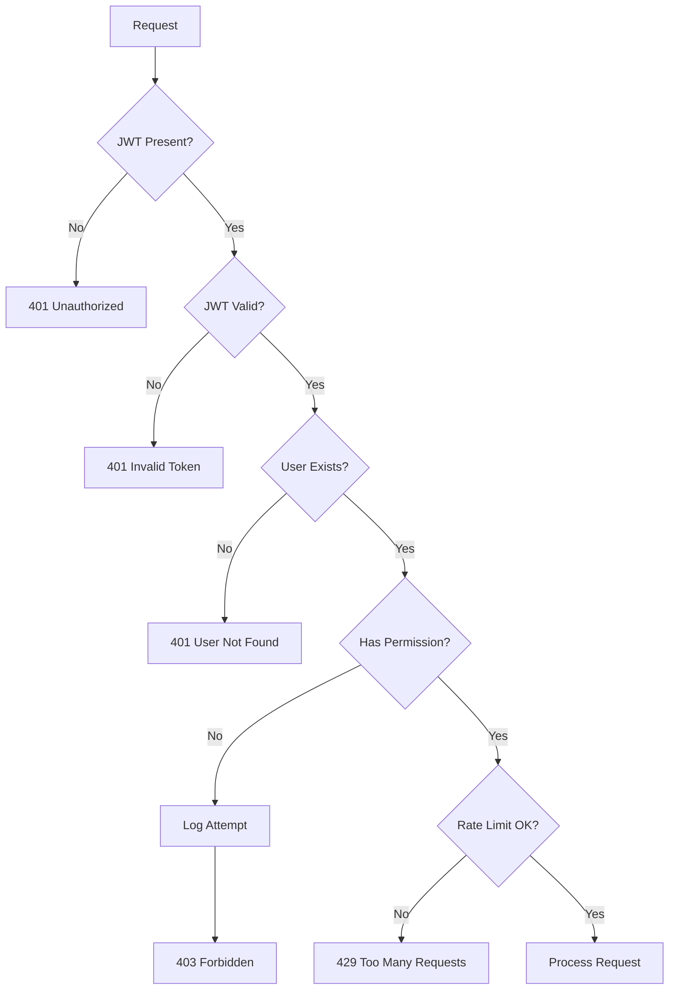

# Authentication Flow Diagrams

## 1. Initial Login Flow



## 2. Authenticated Request Flow



## 3. Session Management Flow



## 4. Role-Based Access Control Flow



## 5. User Creation Flow



## 6. Audit Logging Flow



## 7. Admin User Management Flow



## 8. Security Error Handling Flow



## Key Components

### Middleware Chain
```
Request → validateJWT → loadUser → requireRole → auditAction → Handler
```

### Session Lifecycle
```
Create (30 min) → Refresh (extend 30 min) → Expire/Logout (delete)
```

### User Roles Hierarchy
```
Administrator (Full Access)
    ↓
SME (Content Creation)
    ↓
Student (Learning Access)
```

## Security Checkpoints

1. **JWT Validation**: Every request validates token against Auth0
2. **User Loading**: User data loaded from database
3. **Role Check**: Permissions verified before handler execution
4. **Audit Logging**: All actions logged for security review
5. **Session Management**: 30-minute timeout enforced
6. **Rate Limiting**: 100 requests/minute per IP

## Error Codes Reference

| Code | Status | Description |
|------|--------|-------------|
| UNAUTHORIZED | 401 | Missing or invalid authentication |
| INVALID_TOKEN | 401 | JWT validation failed |
| USER_NOT_FOUND | 401 | User not in database |
| FORBIDDEN | 403 | Insufficient permissions |
| RATE_LIMIT_EXCEEDED | 429 | Too many requests |
| INTERNAL_ERROR | 500 | Server error |

## Best Practices

1. Always use `validateJWT` + `loadUser` together
2. Add `requireRole` for protected resources
3. Use `auditAction` for sensitive operations
4. Refresh sessions before 30-minute expiry
5. Handle errors gracefully with proper status codes
6. Log security events for monitoring
7. Never expose sensitive data in error messages
